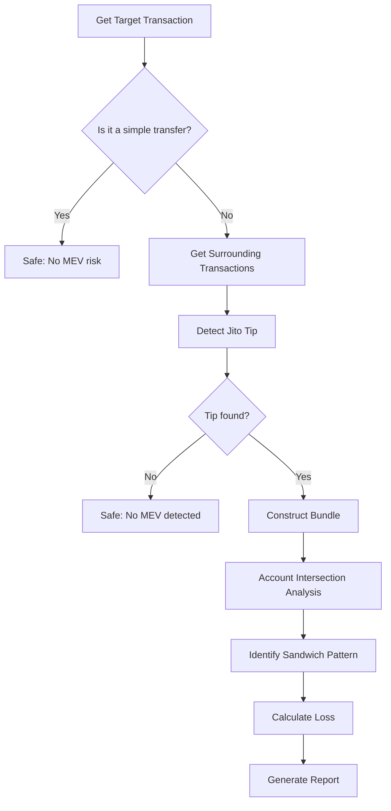

# 🔍 Solana MEV Detector

<div align="center">

[](https://www.rust-lang.org)
[](https://opensource.org/licenses/MIT)
[](http://makeapullrequest.com)

**A high-performance tool for detecting MEV attacks on the Solana blockchain.**

Specializing in detecting Jito bundle-based MEV attacks, including sandwich and front-running attacks, with precise user loss estimation.

[Features](#-features) • [Quick Start](#-quick-start) • [Usage](#-usage) • [Detection-algorithms](#-detection-algorithms) • [Contributing](#-contributing)

</div>

---

## ✨ Features

### 🎯 **Core Detection Capabilities**
- **🥪 Sandwich Attack Detection** - Smart detection based on account intersection and price impact.
- **🏃 Front-running Attack Detection** - Identifies preceding transaction patterns in the same pool.
- **💰 Precise Loss Calculation** - 4 advanced algorithms to estimate actual user losses.
- **📦 Jito Bundle Analysis** - Automatically identifies and parses Jito MEV bundles.

### 🚀 **Advanced Features**
- **Multi-DEX Support** - Supports major DEXs like Raydium, Orca, Jupiter, Pump.fun, etc.
- **Smart Transaction Identification** - Recognizes unknown DEX programs based on account patterns.
- **Efficient Filtering Mechanism** - Automatically skips simple transfers and voting transactions.
- **Real-time Loss Estimation** - Multiple methods to calculate economic losses from MEV attacks.

### 💡 **User Experience**
- **Intuitive Output Interface** - Clear detection results and loss reports.
- **Continuous Detection Mode** - Supports batch detection without restarting.
- **Detailed Logging** - Configurable log levels and debugging information.
- **🆕 Flexible Configuration System** - Customize all detection parameters via a TOML config file.
- **🆕 Hot-Reloadable Parameters** - Adjust detection sensitivity and loss calculation parameters without modifying source code.

## 🏗️ Architecture

```
┌─────────────────┐    ┌─────────────────┐    ┌─────────────────┐
│   main.rs       │    │   client.rs     │    │   mev.rs        │
│                 │    │                 │    │                 │
│ • User Interface│◄──►│ • RPC Client    │◄──►│ • MEV Detection │
│ • Flow Control  │    │ • Data Fetching │    │ • Loss Calculation│
│ • Result Display│    │ • Block Parsing │    │ • Attack ID     │
└─────────────────┘    └─────────────────┘    └─────────────────┘
```

## 🛠️ Tech Stack

- **Language**: Rust 2021 Edition (1.70+)
- **Async Runtime**: Tokio
- **HTTP Client**: Reqwest
- **Serialization**: Serde
- **Logging**: env_logger
- **Encoding**: bs58

## 🚀 Quick Start

### 1️⃣ Prerequisites

```bash
# Install Rust (if not already installed)
curl --proto '=https' --tlsv1.2 -sSf https://sh.rustup.rs | sh

# Clone the project
git clone https://github.com/Tao-2022/solana-jito-mev-detector.git
cd solana-mev-detector
```

### 2️⃣ Configuration

Create a `config.toml` file:

```toml
# RPC Node Configuration
rpc_url = "https://mainnet.helius-rpc.com/?api-key=YOUR_API_KEY"

# Log Level Configuration
log_level = "info"  # Options: error, warn, info, debug, trace

# Optional: Pre-set list of transaction hashes for auto-detection
auto_detect_hashes = [
    "your_transaction_hash_1",
    "your_transaction_hash_2"
]

# MEV Detection Configuration Parameters
[mev_detection]
# Transaction similarity threshold (0.0-1.0, default 0.5 means >50% similarity is considered the same pool)
similarity_threshold = 0.5

# Small transfer threshold (in lamports, default 1,000,000 = 0.001 SOL)
small_transfer_threshold = 1000000

# Price Impact Analysis Parameters
[mev_detection.price_impact]
# Price impact ratio coefficient (default 0.01)
price_impact_ratio = 0.01
# Maximum loss percentage limit (default 10.0%)
max_loss_percentage = 10.0

# Token Balance Change Analysis Parameters
[mev_detection.token_balance]
# Loss coefficient (default 0.005)
loss_coefficient = 0.005
# Maximum loss percentage limit (default 5.0%)
max_loss_percentage = 5.0

# Slippage Estimation Parameters
[mev_detection.slippage]
# Base slippage (default 0.001 = 0.1%)
base_slippage = 0.001
# Complexity factor adjustment (default 0.2)
complexity_factor = 0.2
# Instruction factor adjustment (default 0.1)
instruction_factor = 0.1
# Maximum loss percentage limit (default 3.0%)
max_loss_percentage = 3.0

# SOL Balance Change Analysis Parameters
[mev_detection.sol_balance]
# Impact factor (default 0.6, i.e., 60% impact factor)
impact_factor = 0.6
# Conservative estimation ratio (default 0.3, i.e., 30%)
conservative_ratio = 0.3
# Maximum loss percentage limit (default 8.0%)
max_loss_percentage = 8.0

# Trade Size Estimation Parameters
[mev_detection.trade_size]
# Minimum number of accounts for a swap transaction (default 6)
min_swap_accounts = 6
# Estimated complexity value per instruction (in lamports, default 100,000,000 = 0.1 SOL)
instruction_complexity_value = 100000000
# Estimated value per account (in lamports, default 50,000,000 = 0.05 SOL)
account_factor_value = 50000000
# Minimum trade size estimation (in lamports, default 100,000,000 = 0.1 SOL)
min_trade_size = 100000000
```

### 3️⃣ Compile and Run

```bash
# Development mode
cargo run

# Production mode (recommended)
cargo run --release
```

## 📖 Usage

### Interactive Interface

The program starts with a user-friendly interface:

```
============================================================
🔍 Solana MEV Detector v0.2.0
============================================================

Please enter a Solana transaction hash (or 'exit'/'quit' to close):
> 
```

### How to Use

1.  **Single Detection**: Enter a transaction hash and press Enter.
2.  **Batch Detection**: Set `auto_detect_hashes` in the config file.
3.  **Exit**: Type `exit` or `quit`.

### Example Results

#### ✅ Safe Transaction
```
✅ This is a simple transfer, not a swap. No MEV risk detected.
```

#### 🚨 MEV Attack Detected
```
🎯 Jito bundle detected, analyzing for MEV attack...
📍 Jito tip location: Before the target transaction
💰 Tip amount: 0.001000 SOL
📦 Bundle contains 5 transactions:
  1. Jito tip transaction ⭐
  2. Other transaction
  3. Target transaction 🎯
  4. Other transaction
  5. Other transaction

🚨 Sandwich attack detected!
  Front-run transaction: https://solscan.io/tx/abc123...
  Back-run transaction: https://solscan.io/tx/def456...
  Shared accounts: 4

💸 Estimated User Loss:
  Loss amount: 0.000150 SOL
  Loss percentage: 2.50%
  MEV profit: 0.000200 SOL
  Calculation method: Price Impact Analysis

⚠️ Note: Detection results are for reference only. Please verify with actual transaction data.
```

## 🧮 Loss Calculation Algorithms

### Multi-layered Calculation Methods

We implement 4 advanced loss calculation algorithms, ordered by accuracy:

#### 1. 🎯 **Price Impact Analysis** (Most Accurate)
```rust
loss = user_trade_size * configured_price_impact_ratio
```
- Analyzes the attacker's direct impact on the pool's price.
- Calculates loss based on the actual trade size.
- Accuracy: ⭐⭐⭐⭐⭐
- **Configurable**: `price_impact_ratio`, `max_loss_percentage`

#### 2. 📊 **Token Balance Change Method** (High Accuracy)
```rust
loss = user_size * relative_impact * market_factor * configured_loss_coefficient
```
- Based on relative trade size and market impact factors.
- Considers the number of shared accounts and attacker's trade size.
- Accuracy: ⭐⭐⭐⭐
- **Configurable**: `loss_coefficient`, `max_loss_percentage`

#### 3. 💹 **SOL Balance Analysis** (Medium Accuracy)
```rust
loss = mev_profit * (user_size / total_size) * configured_impact_factor
```
- An improved algorithm based on the ratio of trade sizes.
- Considers the user's proportion of the total transaction volume.
- Accuracy: ⭐⭐⭐
- **Configurable**: `impact_factor`, `conservative_ratio`, `max_loss_percentage`

#### 4. 📉 **Slippage Estimation Method** (Fallback)
```rust
loss = trade_size * (base_slippage * dynamic_adjustment_factor)
```
- Based on transaction complexity and market depth.
- Dynamically calculates the slippage rate.
- Accuracy: ⭐⭐
- **Configurable**: `base_slippage`, `complexity_factor`, `instruction_factor`, `max_loss_percentage`

### Algorithm Advantages

- **Smart Fallback**: Prioritizes the most accurate method, automatically falling back if it fails.
- **Flexible Configuration**: All detection and loss calculation parameters are adjustable via the config file.
- **Loss Caps**: Each method has a configurable, reasonable loss cap for protection.
- **Real-world Validation**: Calibrated against real MEV attack data, supports user-defined tuning.
- **Personalized Adjustment**: Users can adjust detection sensitivity and loss estimation conservatism based on their risk appetite.

## 🔍 Detection Algorithms

### Sandwich Attack Detection Flow



### Core Detection Logic

#### 🔍 **Account Intersection Analysis**
- Extracts all writable accounts from transactions.
- Filters out system accounts and small transfers.
- Calculates the account overlap between preceding and succeeding transactions.

#### 🎯 **Sandwich Pattern Recognition**
- Pattern: Front-run -> Target -> Back-run.
- Account intersection similarity ≥ configured threshold (default 50%).
- Identifies the attacker by the same signer.
- **Configurable**: Adjust sensitivity with `similarity_threshold`.

#### 🏃 **Front-running Detection**
- Detects account overlap between the front-run and target transactions.
- Verifies the transaction time window.
- Analyzes transaction complexity patterns.

### Supported DEX Ecosystem

| DEX             | Program ID       | Status          |
|-----------------|------------------|-----------------|
| Raydium AMM     | `675kPX9MH...`   | ✅ Fully Supported |
| Raydium CLMM    | `CAMMCzo5YL...`  | ✅ Fully Supported |
| Orca Whirlpools | `whirLbMiic...`  | ✅ Fully Supported |
| Orca V1         | `9WzDXwBbmk...`  | ✅ Fully Supported |
| Jupiter         | `JUP6LkbZbj...`  | ✅ Fully Supported |
| Pump.fun        | `6EF8rrecth...`  | ✅ Fully Supported |
| Serum DEX       | `9xQeWvG816...`  | ✅ Fully Supported |
| Unknown DEX     | -                | ✅ Smart Detection |

## ⚙️ Configuration Options

### Basic Configuration

```toml
# Required
rpc_url = "https://your-rpc-endpoint.com"

# Optional
log_level = "info"           # Log level
auto_detect_hashes = []      # List of transactions for auto-detection
```

### Advanced MEV Detection Configuration

#### 🎯 **Similarity Configuration**
```toml
[mev_detection]
# Transaction similarity threshold - controls sandwich attack detection sensitivity
similarity_threshold = 0.5    # 0.0-1.0, default 0.5 (50%)

# Small transfer filter threshold - filters out small transfers to reduce false positives
small_transfer_threshold = 1000000  # lamports (0.001 SOL)
```

#### 💰 **Loss Calculation Configuration**

**Price Impact Analysis Parameters** (Most accurate)
```toml
[mev_detection.price_impact]
price_impact_ratio = 0.01        # Price impact coefficient (1%)
max_loss_percentage = 10.0       # Max loss limit (10%)
```

**Token Balance Change Analysis Parameters**
```toml
[mev_detection.token_balance]
loss_coefficient = 0.005         # Loss calculation coefficient (0.5%)
max_loss_percentage = 5.0        # Max loss limit (5%)
```

**Slippage Estimation Parameters** (Fallback)
```toml
[mev_detection.slippage]
base_slippage = 0.001           # Base slippage (0.1%)
complexity_factor = 0.2         # Complexity adjustment factor
instruction_factor = 0.1        # Instruction count adjustment factor
max_loss_percentage = 3.0       # Max loss limit (3%)
```

**SOL Balance Change Analysis Parameters**
```toml
[mev_detection.sol_balance]
impact_factor = 0.6             # Impact factor (60%)
conservative_ratio = 0.3        # Conservative estimation ratio (30%)
max_loss_percentage = 8.0       # Max loss limit (8%)
```

#### 📊 **Trade Size Estimation Configuration**
```toml
[mev_detection.trade_size]
min_swap_accounts = 6                    # Min accounts to identify a swap
instruction_complexity_value = 100000000 # Estimated value per instruction (0.1 SOL)
account_factor_value = 50000000          # Estimated value per account (0.05 SOL)
min_trade_size = 100000000              # Minimum trade size (0.1 SOL)
```

### Configuration Tuning Guide

#### 🔧 **Increase Detection Sensitivity**
```toml
# Detects MEV attacks more easily, but may increase false positives
similarity_threshold = 0.3        # Lower similarity requirement
small_transfer_threshold = 500000  # Lower small transfer threshold
```

#### 🎯 **Reduce False Positives**
```toml
# Stricter detection conditions, reduces false positives but may miss some attacks
similarity_threshold = 0.7        # Higher similarity requirement
min_swap_accounts = 8            # Higher threshold for identifying swaps
```

#### 💡 **Adjust Economic Loss Sensitivity**
```toml
# Adjust the sensitivity of various loss calculation methods
[mev_detection.price_impact]
price_impact_ratio = 0.005       # Lower price impact sensitivity

[mev_detection.token_balance]
loss_coefficient = 0.003         # More conservative loss estimation
```

### Log Level Descriptions

| Level   | Description        | Use Case         |
|---------|--------------------|------------------|
| `error` | Errors only        | Production       |
| `warn`  | Warnings and errors| Production       |
| `info`  | Basic information  | **Recommended**  |
| `debug` | Detailed debugging | Development      |
| `trace` | All information    | Deep debugging   |

## 🚀 Performance Optimizations

### Smart Filtering Mechanisms
- ⚡ **Pre-check Optimization**: Account list check before instruction parsing.
- 🔄 **Vote Transaction Filtering**: Automatically skips Solana network vote transactions.
- 🎯 **Early Exit**: Quickly identifies transactions with no MEV risk.

### Efficient Data Handling
- 📊 **Minimized RPC Calls**: Smart caching and batch requests.
- 💾 **Memory Optimization**: Timely release of unneeded transaction data.
- 🔒 **Concurrency Safety**: Supports thread-safe data access.

### Detection Accuracy Control
- 🎛️ **Multi-layer Validation**: Multiple checks on program ID, account list, and instruction data.
- 🚫 **False Positive Control**: Reduces false positives through multiple feature checks.
- 🌐 **Comprehensive Coverage**: Supports detection for both known and unknown DEXs.

## 🧪 Testing and Validation

### Running Tests

```bash
# Run all tests
cargo test

# Run a specific test
cargo test test_sandwich_detection

# Run performance tests
cargo test --release -- --nocapture
```

### Code Quality Checks

```bash
# Format code
cargo fmt

# Static analysis
cargo clippy

# Security audit
cargo audit
```

## 🤝 Contributing

We welcome all forms of contributions!

### How to Contribute

1.  **🐛 Report Bugs**: Describe issues in the Issues tab.
2.  **💡 Suggest Features**: Propose new feature ideas.
3.  **📝 Improve Documentation**: Enhance docs and examples.
4.  **🔧 Contribute Code**: Submit a Pull Request.

### Development Flow

```bash
# 1. Fork the project
# 2. Create a feature branch
git checkout -b feature/amazing-feature

# 3. Commit your changes
git commit -m "Add: some amazing feature"

# 4. Push to the branch
git push origin feature/amazing-feature

# 5. Create a new Pull Request
```

### Code Style

- 🦀 Follow the official Rust style guidelines.
- 📝 Add doc comments for public APIs.
- ✅ Ensure all tests pass.
- 🧹 Run `cargo fmt` and `cargo clippy`.

## 🛡️ Security Considerations

### Data Privacy
- 🔒 Does not store any user private keys or sensitive information.
- 🌐 Only reads public on-chain transaction data.
- 📡 All data is transmitted via HTTPS.

### Usage Limitations
- ⚖️ For educational and research purposes only.
- 🚫 Not to be used for any illegal activities.
- 📋 Comply with relevant laws and regulations.

## 📄 License

This project is licensed under the [MIT License](LICENSE).

## ⚠️ Disclaimer

- 🎓 This tool is for educational and research purposes only.
- 📊 Detection results are for reference and do not constitute investment advice.
- ⚖️ Users assume all risks associated with its use.
- 🔍 It is recommended to verify results with multiple tools.

## 🔗 Related Resources

### Official Documentation
- [Solana Developer Docs](https://docs.solana.com/)
- [Jito Official Docs](https://jito-labs.gitbook.io/jito/)
- [The Rust Programming Language Book](https://doc.rust-lang.org/book/)

### Learning Resources
- [MEV Research Papers](https://ethereum.org/en/developers/docs/mev/)
- [Solana Transaction Structure](https://docs.solana.com/developing/programming-model/transactions)
- [DeFi Security Best Practices](https://consensys.github.io/smart-contract-best-practices/)

### Community
- [Solana Discord](https://discord.gg/solana)
- [Official Rust Users Forum](https://users.rust-lang.org/)

## 🚀 Version Updates

### v0.2.0 - Configuration System Refactor
- ✨ Added full support for a TOML configuration file.
- 🔧 All MEV detection parameters are now configurable.
- 📊 Supports independent parameter configuration for 4 loss calculation algorithms.
- ⚡ Users can customize detection sensitivity.
- 🎯 Added a configuration tuning guide and best practice recommendations.

---

<div align="center">

**If this project helps you, please give it a ⭐️ to show your support!**

[⭐ Star](https://github.com/Tao-2022/solana-jito-mev-detector) • [🍴 Fork](https://github.com/Tao-2022/solana-jito-mev-detector/fork) • [📋 Issues](https://github.com/Tao-2022/solana-jito-mev-detector/issues) • [📖 Wiki](https://github.com/Tao-2022/solana-jito-mev-detector/wiki)

Made with ❤️ by the Solana Community

</div>
