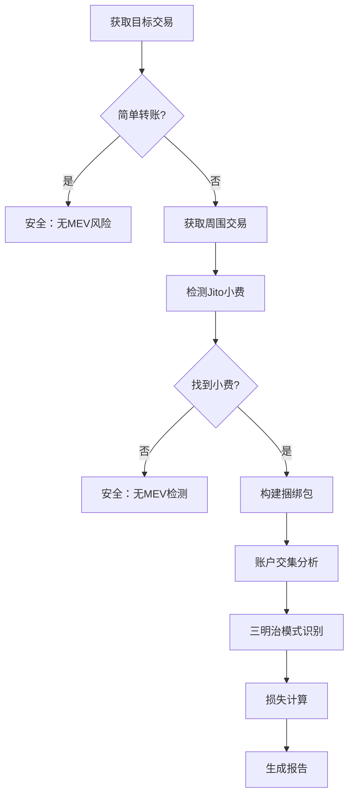

# 🔍 Solana MEV 检测器

<div align="center">

[](https://www.rust-lang.org)
[](https://opensource.org/licenses/MIT)
[](http://makeapullrequest.com)

**一个高性能的 Solana 链上 MEV 攻击检测工具**

专门检测基于 Jito 捆绑包的 MEV 攻击，包括三明治攻击和抢跑攻击，并提供精确的用户损失估算。

[功能特点](#-功能特点) • [快速开始](#-快速开始) • [使用说明](#-使用说明) • [检测算法](#-检测算法) • [贡献](#-贡献)

</div>

---

## ✨ 功能特点

### 🎯 **核心检测能力**
- **🥪 三明治攻击检测** - 基于账户交集和价格影响的智能检测
- **🏃 抢跑攻击检测** - 识别相同池子的前置交易模式  
- **💰 精确损失计算** - 4种先进算法估算用户实际损失
- **📦 Jito 捆绑包分析** - 自动识别和解析 Jito MEV 捆绑包

### 🚀 **先进特性**
- **多 DEX 支持** - Raydium、Orca、Jupiter、Pump.fun 等主流 DEX
- **智能交易识别** - 基于账户模式识别未知 DEX 程序
- **高效过滤机制** - 自动跳过简单转账和投票交易
- **实时损失估算** - 多种方法计算 MEV 攻击造成的经济损失

### 💡 **用户体验**
- **直观输出界面** - 清晰的检测结果和损失报告
- **连续检测模式** - 支持批量检测，无需重启
- **详细日志记录** - 可配置的日志级别和调试信息

## 🏗️ 架构设计

```
┌─────────────────┐    ┌─────────────────┐    ┌─────────────────┐
│   main.rs       │    │   client.rs     │    │   mev.rs        │
│                 │    │                 │    │                 │
│ • 用户界面      │◄──►│ • RPC 客户端    │◄──►│ • MEV 检测算法  │
│ • 流程控制      │    │ • 数据获取      │    │ • 损失计算      │
│ • 结果展示      │    │ • 区块解析      │    │ • 攻击识别      │
└─────────────────┘    └─────────────────┘    └─────────────────┘
```

## 🛠️ 技术栈

- **语言**: Rust 2021 Edition (1.70+)
- **异步运行时**: Tokio
- **HTTP 客户端**: Reqwest
- **序列化**: Serde
- **日志**: env_logger
- **编码**: bs58

## 🚀 快速开始

### 1️⃣ 环境准备

```bash
# 安装 Rust (如果尚未安装)
curl --proto '=https' --tlsv1.2 -sSf https://sh.rustup.rs | sh

# 克隆项目
git clone https://github.com/your-repo/solana-mev-detector.git
cd solana-mev-detector
```

### 2️⃣ 配置设置

创建 `config.toml` 配置文件：

```toml
# RPC 节点配置
rpc_url = "https://mainnet.helius-rpc.com/?api-key=YOUR_API_KEY"

# 日志级别配置 
log_level = "info"  # 可选: error, warn, info, debug, trace

# 可选：预设的交易哈希列表，用于自动检测
auto_detect_hashes = [
    "your_transaction_hash_1",
    "your_transaction_hash_2"
]
```

### 3️⃣ 编译运行

```bash
# 开发模式
cargo run

# 生产模式 (推荐)
cargo run --release
```

## 📖 使用说明

### 交互界面

程序启动后显示友好的用户界面：

```
============================================================
🔍 Solana MEV 检测器 v0.2.0
============================================================

请输入Solana交易哈希 (输入 'exit' 或 'quit' 退出):
> 
```

### 操作指南

1. **单次检测**: 输入交易哈希并按 Enter
2. **批量检测**: 在配置文件中设置 `auto_detect_hashes`
3. **退出程序**: 输入 `exit` 或 `quit`

### 示例检测结果

#### ✅ 安全交易
```
✅ 该交易为简单转账，不涉及Swap，无MEV风险。
```

#### 🚨 检测到 MEV 攻击
```
🎯 检测到Jito捆绑包交易，正在分析MEV攻击...
📍 Jito小费位置: 目标交易前方
💰 小费金额: 0.001000 SOL
📦 捆绑包包含5笔交易:
  1. Jito小费交易 ⭐
  2. 其他交易  
  3. 目标交易 🎯
  4. 其他交易
  5. 其他交易

🚨 检测到三明治攻击!
  前置交易: https://solscan.io/tx/abc123...
  后置交易: https://solscan.io/tx/def456...
  共享账户数: 4

💸 用户损失估算:
  损失金额: 0.000150 SOL
  损失百分比: 2.50%
  MEV利润: 0.000200 SOL
  计算方法: 价格影响分析法

⚠️ 注意: 检测结果仅供参考，建议结合实际交易数据验证
```

## 🧮 损失计算算法

### 多层次计算方法

我们实现了4种先进的损失计算算法，按准确性排序：

#### 1. 🎯 **价格影响分析法** (最准确)
```rust
损失 = 用户交易规模 × 价格影响百分比
```
- 分析攻击者对池子价格的直接影响
- 基于实际交易规模计算损失
- 准确性: ⭐⭐⭐⭐⭐

#### 2. 📊 **Token余额变化法** (高准确)
```rust
损失 = 用户规模 × 相对影响 × 市场因子 × 0.5%
```
- 基于相对交易规模和市场影响因子
- 考虑共享账户数量和攻击者交易规模
- 准确性: ⭐⭐⭐⭐

#### 3. 💹 **SOL余额分析法** (中等准确)
```rust  
损失 = MEV利润 × (用户规模/总规模) × 60%
```
- 基于交易规模比例的改进算法
- 考虑用户在总交易量中的占比
- 准确性: ⭐⭐⭐

#### 4. 📉 **滑点估算法** (兜底方案)
```rust
损失 = 交易规模 × 动态滑点率
```
- 基于交易复杂度和市场深度
- 动态计算滑点率
- 准确性: ⭐⭐

### 算法优势

- **智能降级**: 优先使用最准确的方法，失败时自动降级
- **损失上限**: 各方法都有合理的损失上限保护
- **实际验证**: 基于真实 MEV 攻击数据校准

## 🔍 检测算法

### 三明治攻击检测流程



### 核心检测逻辑

#### 🔍 **账户交集分析**
- 提取所有交易的可写账户
- 过滤系统账户和小额转账
- 计算前后交易的账户重叠度

#### 🎯 **三明治模式识别**
- 前置交易 → 目标交易 → 后置交易
- 账户交集相似度 ≥ 70%
- 相同签名者识别攻击者

#### 🏃 **抢跑检测**
- 检测前置交易与目标交易的账户重叠
- 验证交易时间窗口
- 分析交易复杂度模式

### 支持的 DEX 生态

| DEX | 程序 ID | 支持状态 |
|-----|---------|----------|
| Raydium AMM | `675kPX9MH...` | ✅ 完全支持 |
| Raydium CLMM | `CAMMCzo5YL...` | ✅ 完全支持 |
| Orca Whirlpools | `whirLbMiic...` | ✅ 完全支持 |
| Orca V1 | `9WzDXwBbmk...` | ✅ 完全支持 |
| Jupiter | `JUP6LkbZbj...` | ✅ 完全支持 |
| Pump.fun | `6EF8rrecth...` | ✅ 完全支持 |
| Serum DEX | `9xQeWvG816...` | ✅ 完全支持 |
| 未知 DEX | - | ✅ 智能识别 |

## ⚙️ 配置选项

### 基础配置

```toml
# 必需配置
rpc_url = "https://your-rpc-endpoint.com"

# 可选配置
log_level = "info"           # 日志级别
auto_detect_hashes = []      # 自动检测的交易列表
```

### 高级配置

在 `src/mev.rs` 中可调整检测参数：

```rust
// 损失计算参数
const SMALL_TRANSFER_THRESHOLD: u64 = 1_000_000;  // 0.001 SOL

// 检测敏感度
const SIMILARITY_THRESHOLD: f64 = 0.7;            // 70% 相似度

// 支持的 DEX 程序
const DEX_PROGRAMS: [&str; 7] = [...];
```

### 日志级别说明

| 级别 | 描述 | 用途 |
|------|------|------|
| `error` | 仅错误信息 | 生产环境 |
| `warn` | 警告和错误 | 生产环境 |  
| `info` | 基本信息 | **推荐** |
| `debug` | 详细调试 | 开发调试 |
| `trace` | 全部信息 | 深度调试 |

## 🚀 性能优化

### 智能过滤机制
- ⚡ **预检查优化**: 指令解析前的账户列表检查
- 🔄 **投票交易过滤**: 自动跳过 Solana 网络投票交易  
- 🎯 **早期退出**: 快速识别无 MEV 风险的交易

### 高效数据处理
- 📊 **最小化 RPC 调用**: 智能缓存和批量请求
- 💾 **内存优化**: 及时释放不需要的交易数据
- 🔒 **并发安全**: 支持多线程安全的数据访问

### 检测精度控制
- 🎛️ **多层验证**: 程序ID、账户列表、指令数据的多重验证
- 🚫 **误报控制**: 通过多种特征降低误报率
- 🌐 **全面覆盖**: 支持已知和未知 DEX 的检测

## 🧪 测试与验证

### 运行测试

```bash
# 运行所有测试
cargo test

# 运行特定测试
cargo test test_sandwich_detection

# 运行性能测试
cargo test --release -- --nocapture
```

### 代码质量检查

```bash
# 格式化代码
cargo fmt

# 静态分析
cargo clippy

# 安全审计
cargo audit
```

## 🤝 贡献

我们欢迎所有形式的贡献！

### 贡献方式

1. **🐛 报告 Bug**: 在 Issues 中描述问题
2. **💡 功能建议**: 提出新功能想法
3. **📝 文档改进**: 改进文档和示例
4. **🔧 代码贡献**: 提交 Pull Request

### 开发流程

```bash
# 1. Fork 项目
# 2. 创建功能分支
git checkout -b feature/amazing-feature

# 3. 提交更改
git commit -m "Add: 添加惊人的新功能"

# 4. 推送分支
git push origin feature/amazing-feature

# 5. 创建 Pull Request
```

### 代码规范

- 🦀 遵循 Rust 官方代码风格
- 📝 为公共 API 添加文档注释
- ✅ 确保所有测试通过
- 🧹 运行 `cargo fmt` 和 `cargo clippy`

## 🛡️ 安全考虑

### 数据隐私
- 🔒 不存储任何用户私钥或敏感信息
- 🌐 仅读取公开的链上交易数据
- 📡 所有数据通过 HTTPS 传输

### 使用限制
- ⚖️ 仅用于教育和研究目的
- 🚫 不得用于任何非法活动
- 📋 遵守相关法律法规

## 📄 许可证

本项目采用 [MIT 许可证](LICENSE)。

## ⚠️ 免责声明

- 🎓 本工具仅用于教育和研究目的
- 📊 检测结果仅供参考，不构成投资建议
- ⚖️ 使用者需自行承担使用风险
- 🔍 建议结合多种工具验证检测结果

## 🔗 相关资源

### 官方文档
- [Solana 开发者文档](https://docs.solana.com/)
- [Jito 官方文档](https://jito-labs.gitbook.io/jito/)
- [Rust 语言指南](https://doc.rust-lang.org/book/)

### 学习资源
- [MEV 研究论文](https://ethereum.org/en/developers/docs/mev/)
- [Solana 交易结构](https://docs.solana.com/developing/programming-model/transactions)
- [DeFi 安全最佳实践](https://consensys.github.io/smart-contract-best-practices/)

### 社区
- [Solana Discord](https://discord.gg/solana)
- [Rust 官方论坛](https://users.rust-lang.org/)

---

<div align="center">

**如果这个项目对你有帮助，请给个 ⭐️ 支持一下！**

[⭐ Star](https://github.com/Tao-2022/solana-jito-mev-detector) • [🍴 Fork](https://github.com/Tao-2022/solana-jito-mev-detector/fork) • [📋 Issues](https://github.com/Tao-2022/solana-jito-mev-detector/issues) • [📖 Wiki](https://github.com/Tao-2022/solana-jito-mev-detector/wiki)

Made with ❤️ by the Solana Community

</div>