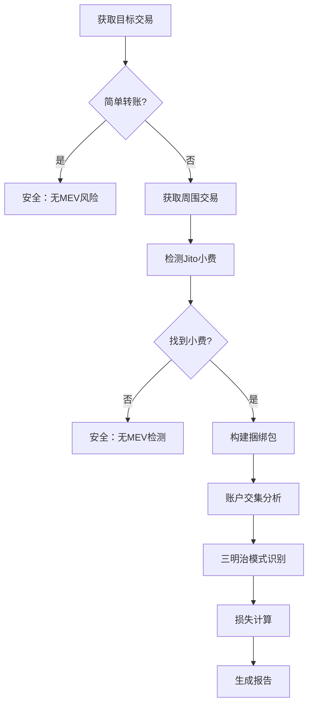

# 🔍 Solana MEV 受害者检测器（韭菜检测器）

<div align="center">

[](https://www.rust-lang.org)
[](https://opensource.org/licenses/MIT)
[](http://makeapullrequest.com)

**一个高性能的 Solana 链上 MEV 攻击检测工具**

专门检测基于 Jito 捆绑包的 MEV 攻击，包括三明治攻击和抢跑攻击，并提供精确的用户损失估算。

[功能特点](#-功能特点) • [快速开始](#-快速开始) • [使用说明](#-使用说明) • [检测算法](#-检测算法) • [贡献](#-贡献)

</div>

---

## ✨ 功能特点

### 🎯 **核心检测能力**
- **🥪 三明治攻击检测** - 基于账户交集和价格影响的智能检测
- **🏃 抢跑攻击检测** - 识别相同池子的前置交易模式  
- **💰 精确损失计算** - 4种先进算法估算用户实际损失
- **📦 Jito 捆绑包分析** - 自动识别和解析 Jito MEV 捆绑包
- **🔍 置信度评估** - 每个检测结果都包含详细的置信度评分
- **✅ 智能验证** - 多重验证机制确保结果准确性

### 🚀 **先进特性**
- **多 DEX 支持** - Raydium、Orca、Jupiter、Pump.fun 等主流 DEX
- **智能交易识别** - 基于账户模式识别未知 DEX 程序  
- **高效过滤机制** - 自动跳过简单转账和投票交易
- **实时损失估算** - 多种方法计算 MEV 攻击造成的经济损失
- **多方法交叉验证** - 并行运行多种算法，选择最佳结果
- **自适应权重调整** - 根据程序类型动态调整检测权重

### 💡 **用户体验**
- **直观输出界面** - 清晰的检测结果和损失报告
- **双语支持** - 完整的中英文界面支持 (可配置)
- **连续检测模式** - 支持批量检测，无需重启
- **详细日志记录** - 可配置的日志级别和调试信息
- **🆕 灵活配置系统** - 通过 TOML 配置文件自定义所有检测参数
- **🆕 参数热调整** - 无需修改源代码即可调整检测敏感度和损失计算参数
- **🆕 可视化指标** - 置信度图标 (🟢🟡🔴) 和验证状态 (✅⚠️)

## 🏗️ 架构设计

```
┌─────────────────┐    ┌─────────────────┐    ┌─────────────────┐
│   main.rs       │    │   client.rs     │    │   mev.rs        │
│                 │    │                 │    │                 │
│ • 用户界面      │◄──►│ • RPC 客户端    │◄──►│ • MEV 检测算法  │
│ • 流程控制      │    │ • 数据获取      │    │ • 损失计算      │
│ • 结果展示      │    │ • 区块解析      │    │ • 攻击识别      │
└─────────────────┘    └─────────────────┘    └─────────────────┘
```

## 🛠️ 技术栈

- **语言**: Rust 2021 Edition (1.70+)
- **异步运行时**: Tokio
- **HTTP 客户端**: Reqwest
- **序列化**: Serde
- **日志**: env_logger
- **编码**: bs58

## 🚀 快速开始

### 1️⃣ 环境准备

```bash
# 安装 Rust (如果尚未安装)
curl --proto '=https' --tlsv1.2 -sSf https://sh.rustup.rs | sh

# 克隆项目
git clone https://github.com/Tao-2022/solana-jito-mev-detector.git
cd solana-mev-detector
```

### 2️⃣ 配置设置

创建 `config.toml` 配置文件：

```toml
# RPC 节点配置
rpc_url = "https://mainnet.helius-rpc.com/?api-key=YOUR_API_KEY"

# 语言设置: "en" for English, "zh" for Chinese
language = "zh"

# 日志级别配置 
log_level = "info"  # 可选: error, warn, info, debug, trace

# 可选：预设的交易哈希列表，用于自动检测
auto_detect_hashes = [
    "your_transaction_hash_1",
    "your_transaction_hash_2"
]

# MEV检测配置参数
[mev_detection]
# 交易相似度阈值 (0.0-1.0，默认0.5表示50%以上相似度认为是同一个池子)
similarity_threshold = 0.5

# 小额转账阈值 (lamports，默认1,000,000 = 0.001 SOL)
small_transfer_threshold = 1000000

# 价格影响分析法参数
[mev_detection.price_impact]
# 价格影响比例系数 (默认0.01)
price_impact_ratio = 0.01
# 最大损失百分比限制 (默认10.0%)
max_loss_percentage = 10.0

# Token余额变化分析法参数
[mev_detection.token_balance]
# 损失系数 (默认0.005)
loss_coefficient = 0.005
# 最大损失百分比限制 (默认5.0%)
max_loss_percentage = 5.0

# 滑点估算法参数
[mev_detection.slippage]
# 基础滑点 (默认0.001 = 0.1%)
base_slippage = 0.001
# 复杂度因子调整参数 (默认0.2)
complexity_factor = 0.2
# 指令因子调整参数 (默认0.1)
instruction_factor = 0.1
# 最大损失百分比限制 (默认3.0%)
max_loss_percentage = 3.0

# SOL余额变化分析法参数
[mev_detection.sol_balance]
# 影响因子 (默认0.6，即60%的影响因子)
impact_factor = 0.6
# 保守估算比例 (默认0.3，即30%)
conservative_ratio = 0.3
# 最大损失百分比限制 (默认8.0%)
max_loss_percentage = 8.0

# 交易规模估算参数
[mev_detection.trade_size]
# swap交易最少账户数量 (默认6)
min_swap_accounts = 6
# 每个指令的复杂度估算值 (lamports，默认100,000,000 = 0.1 SOL)
instruction_complexity_value = 100000000
# 每个账户的估算值 (lamports，默认50,000,000 = 0.05 SOL)
account_factor_value = 50000000
# 最小交易规模估算 (lamports，默认100,000,000 = 0.1 SOL)
min_trade_size = 100000000
```

### 3️⃣ 编译运行

```bash
# 开发模式
cargo run

# 生产模式 (推荐)
cargo run --release
```

## 📖 使用说明

### 交互界面

程序启动后显示友好的用户界面：

```
============================================================
🔍 Solana MEV 检测器 v0.2.0
============================================================

请输入Solana交易哈希 (输入 'exit' 或 'quit' 退出):
> 
```

### 操作指南

1. **单次检测**: 输入交易哈希并按 Enter
2. **批量检测**: 在配置文件中设置 `auto_detect_hashes`
3. **退出程序**: 输入 `exit` 或 `quit`

### 示例检测结果

#### ✅ 安全交易
```
✅ 该交易为简单转账，不涉及Swap，无MEV风险。
```

#### 🚨 检测到 MEV 攻击
```
🎯 检测到Jito捆绑包交易，正在分析MEV攻击...
📍 Jito小费位置: 目标交易前方
💰 小费金额: 0.001000 SOL
📦 捆绑包包含5笔交易:
  1. Jito小费交易 ⭐
  2. 其他交易  
  3. 目标交易 🎯
  4. 其他交易
  5. 其他交易

🚨 检测到三明治攻击!
  前置交易: https://solscan.io/tx/abc123...
  后置交易: https://solscan.io/tx/def456...
  共享账户数: 4

💸 用户损失估算:
  损失金额: 0.000150 SOL
  损失百分比: 2.50%
  MEV利润: 0.000200 SOL
  计算方法: 价格影响分析法 V2
  🟢 Confidence: 85.2%
  ✅ Validation: Passed

⚠️ 注意: 检测结果仅供参考，建议结合实际交易数据验证
```

## 🧮 损失计算算法

### 🔄 改进的多方法计算框架

我们实现了全新的损失计算系统，包含4种先进算法和智能选择机制：

#### 🆕 **智能算法选择**
- **并行计算**: 所有方法同时运行，收集多个结果
- **置信度评分**: 每个结果都有详细的置信度评估 (0.0-1.0)
- **验证机制**: 多重边界检查确保结果合理性
- **最佳选择**: 优先选择通过验证且置信度最高的结果

#### 1. 🎯 **价格影响分析法 V2** (最准确)
```rust
// 改进的价格影响计算
market_impact_ratio = calculate_market_impact_ratio(front_value, target_value, shared_accounts)
损失 = 用户交易价值 × market_impact_ratio
```
- **新特性**: 基于实际交易价值而非估算规模
- **智能权重**: 根据DEX程序类型动态调整权重
- **准确性**: ⭐⭐⭐⭐⭐
- **置信度**: 通常 80-95%

#### 2. 📊 **代币流动分析法** (高准确)
```rust
// 基于代币实际流动的损失分析
liquidity_impact = calculate_liquidity_impact(front_flow, target_flow, shared_accounts)
损失 = 目标交易代币价值 × liquidity_impact
```
- **新特性**: 分析实际代币流动而非简单估算
- **流动性建模**: 考虑攻击对市场流动性的真实影响
- **准确性**: ⭐⭐⭐⭐
- **置信度**: 通常 70-85%

#### 3. 💹 **攻击者利润分析法** (改进版)
```rust
// 基于攻击者净收益的反向计算
net_profit = gross_profit - transaction_costs
user_loss_ratio = calculate_user_loss_ratio(target_value, gross_profit)
损失 = net_profit × user_loss_ratio
```
- **新特性**: 考虑交易成本，计算攻击者净利润
- **改进识别**: 更准确的攻击者地址识别算法  
- **准确性**: ⭐⭐⭐⭐
- **置信度**: 通常 75-90%

#### 4. 📉 **保守滑点估算法** (兜底方案)
```rust
// 更保守的滑点计算
conservative_slippage = base_slippage × complexity_adjustment × 0.5
损失 = 交易价值 × conservative_slippage
```
- **新特性**: 更保守的估算，降低过高估计风险
- **边界保护**: 严格的10%损失上限
- **准确性**: ⭐⭐⭐
- **置信度**: 通常 50-70%

### 🔍 质量保证机制

#### **验证条件**
- ✅ 损失不超过交易价值的20%
- ✅ MEV利润必须大于等于用户损失
- ✅ 损失金额在合理范围内 (≥1000 lamports)
- ✅ 如果检测到MEV攻击，损失不能为0

#### **置信度计算**
- **交易价值置信度** (40%权重): 基于SOL金额、指令复杂度等
- **共享账户置信度** (30%权重): 账户交集数量和质量
- **交易规模合理性** (20%权重): 前后交易规模的合理比例
- **基础置信度** (10%权重): DEX识别和其他因素

#### **结果选择逻辑**
1. **首选**: 通过验证 + 置信度最高的结果
2. **备选**: 如无通过验证的结果，选择置信度最高的
3. **保底**: 始终提供保守滑点估算作为兜底结果

### 🎯 算法优势

- **🔄 多方法交叉验证**: 并行运行避免单点失效
- **🎯 智能结果选择**: 基于置信度和验证状态的最佳选择
- **📊 透明度提升**: 用户可看到置信度评分和验证状态
- **🛡️ 鲁棒性增强**: 多重边界检查和异常处理
- **⚙️ 完全可配置**: 所有参数均可通过配置文件调整

## 🔍 检测算法

### 三明治攻击检测流程



### 核心检测逻辑

#### 🔍 **账户交集分析**
- 提取所有交易的可写账户
- 过滤系统账户和小额转账
- 计算前后交易的账户重叠度

#### 🎯 **三明治模式识别**
- 前置交易 → 目标交易 → 后置交易
- 账户交集相似度 ≥ 配置的相似度阈值 (默认50%)
- 相同签名者识别攻击者
- **可配置**: 通过 `similarity_threshold` 调整检测敏感度

#### 🏃 **抢跑检测**
- 检测前置交易与目标交易的账户重叠
- 验证交易时间窗口
- 分析交易复杂度模式

### 支持的 DEX 生态

| DEX | 程序 ID | 支持状态 |
|-----|---------|----------|
| Raydium AMM | `675kPX9MH...` | ✅ 完全支持 |
| Raydium CLMM | `CAMMCzo5YL...` | ✅ 完全支持 |
| Orca Whirlpools | `whirLbMiic...` | ✅ 完全支持 |
| Orca V1 | `9WzDXwBbmk...` | ✅ 完全支持 |
| Jupiter | `JUP6LkbZbj...` | ✅ 完全支持 |
| Pump.fun | `6EF8rrecth...` | ✅ 完全支持 |
| Serum DEX | `9xQeWvG816...` | ✅ 完全支持 |
| 未知 DEX | - | ✅ 智能识别 |

## ⚙️ 配置选项

### 基础配置

```toml
# 必需配置
rpc_url = "https://your-rpc-endpoint.com"

# 可选配置
language = "zh"              # 界面语言: "en" 或 "zh"
log_level = "info"           # 日志级别
auto_detect_hashes = []      # 自动检测的交易列表
```

### 高级 MEV 检测配置

#### 🎯 **相似度配置**
```toml
[mev_detection]
# 交易相似度阈值 - 控制三明治攻击检测的敏感度
similarity_threshold = 0.5    # 0.0-1.0，默认0.5 (50%)

# 小额转账过滤阈值 - 过滤掉小额转账以减少误报
small_transfer_threshold = 1000000  # lamports (0.001 SOL)
```

#### 💰 **损失计算配置**

**价格影响分析法参数** (最精确的方法)
```toml
[mev_detection.price_impact]
price_impact_ratio = 0.01        # 价格影响系数 (1%)
max_loss_percentage = 10.0       # 最大损失限制 (10%)
```

**Token余额变化分析法参数**
```toml
[mev_detection.token_balance]
loss_coefficient = 0.005         # 损失计算系数 (0.5%)
max_loss_percentage = 5.0        # 最大损失限制 (5%)
```

**滑点估算法参数** (兜底方案)
```toml
[mev_detection.slippage]
base_slippage = 0.001           # 基础滑点 (0.1%)
complexity_factor = 0.2         # 复杂度调整因子
instruction_factor = 0.1        # 指令数量调整因子
max_loss_percentage = 3.0       # 最大损失限制 (3%)
```

**SOL余额变化分析法参数**
```toml
[mev_detection.sol_balance]
impact_factor = 0.6             # 影响因子 (60%)
conservative_ratio = 0.3        # 保守估算比例 (30%)
max_loss_percentage = 8.0       # 最大损失限制 (8%)
```

#### 📊 **交易规模估算配置**
```toml
[mev_detection.trade_size]
min_swap_accounts = 6                    # 识别swap的最少账户数
instruction_complexity_value = 100000000 # 每指令估值 (0.1 SOL)
account_factor_value = 50000000          # 每账户估值 (0.05 SOL)
min_trade_size = 100000000              # 最小交易规模 (0.1 SOL)
```

### 配置调优指南

#### 🔧 **提高检测敏感度**
```toml
# 更容易检测到MEV攻击，但可能增加误报
similarity_threshold = 0.3        # 降低相似度要求
small_transfer_threshold = 500000  # 降低小额转账阈值
```

#### 🎯 **降低误报率**
```toml
# 更严格的检测条件，减少误报但可能漏检
similarity_threshold = 0.7        # 提高相似度要求
min_swap_accounts = 8            # 提高swap识别门槛
```

#### 💡 **经济损失敏感度调整**
```toml
# 调整各种损失计算方法的敏感度
[mev_detection.price_impact]
price_impact_ratio = 0.005       # 降低价格影响敏感度

[mev_detection.token_balance]
loss_coefficient = 0.003         # 更保守的损失估算
```

### 日志级别说明

| 级别 | 描述 | 用途 |
|------|------|------|
| `error` | 仅错误信息 | 生产环境 |
| `warn` | 警告和错误 | 生产环境 |  
| `info` | 基本信息 | **推荐** |
| `debug` | 详细调试 | 开发调试 |
| `trace` | 全部信息 | 深度调试 |

## 🚀 性能优化

### 智能过滤机制
- ⚡ **预检查优化**: 指令解析前的账户列表检查
- 🔄 **投票交易过滤**: 自动跳过 Solana 网络投票交易  
- 🎯 **早期退出**: 快速识别无 MEV 风险的交易

### 高效数据处理
- 📊 **最小化 RPC 调用**: 智能缓存和批量请求
- 💾 **内存优化**: 及时释放不需要的交易数据
- 🔒 **并发安全**: 支持多线程安全的数据访问

### 检测精度控制
- 🎛️ **多层验证**: 程序ID、账户列表、指令数据的多重验证
- 🚫 **误报控制**: 通过多种特征降低误报率
- 🌐 **全面覆盖**: 支持已知和未知 DEX 的检测

## 🧪 测试与验证

### 运行测试

```bash
# 运行所有测试
cargo test

# 运行特定测试
cargo test test_sandwich_detection

# 运行性能测试
cargo test --release -- --nocapture
```

### 代码质量检查

```bash
# 格式化代码
cargo fmt

# 静态分析
cargo clippy

# 安全审计
cargo audit
```

## 🤝 贡献

我们欢迎所有形式的贡献！

### 贡献方式

1. **🐛 报告 Bug**: 在 Issues 中描述问题
2. **💡 功能建议**: 提出新功能想法
3. **📝 文档改进**: 改进文档和示例
4. **🔧 代码贡献**: 提交 Pull Request

### 开发流程

```bash
# 1. Fork 项目
# 2. 创建功能分支
git checkout -b feature/amazing-feature

# 3. 提交更改
git commit -m "Add: 添加惊人的新功能"

# 4. 推送分支
git push origin feature/amazing-feature

# 5. 创建 Pull Request
```

### 代码规范

- 🦀 遵循 Rust 官方代码风格
- 📝 为公共 API 添加文档注释
- ✅ 确保所有测试通过
- 🧹 运行 `cargo fmt` 和 `cargo clippy`

## 🛡️ 安全考虑

### 数据隐私
- 🔒 不存储任何用户私钥或敏感信息
- 🌐 仅读取公开的链上交易数据
- 📡 所有数据通过 HTTPS 传输

### 使用限制
- ⚖️ 仅用于教育和研究目的
- 🚫 不得用于任何非法活动
- 📋 遵守相关法律法规

## 📄 许可证

本项目采用 [MIT 许可证](LICENSE)。

## ⚠️ 免责声明

- 🎓 本工具仅用于教育和研究目的
- 📊 检测结果仅供参考，不构成投资建议
- ⚖️ 使用者需自行承担使用风险
- 🔍 建议结合多种工具验证检测结果

## 🔗 相关资源

### 官方文档
- [Solana 开发者文档](https://docs.solana.com/)
- [Jito 官方文档](https://jito-labs.gitbook.io/jito/)
- [Rust 语言指南](https://doc.rust-lang.org/book/)

### 学习资源
- [MEV 研究论文](https://ethereum.org/en/developers/docs/mev/)
- [Solana 交易结构](https://docs.solana.com/developing/programming-model/transactions)
- [DeFi 安全最佳实践](https://consensys.github.io/smart-contract-best-practices/)

### 社区
- [Solana Discord](https://discord.gg/solana)
- [Rust 官方论坛](https://users.rust-lang.org/)

## 🚀 版本更新

### v0.2.1 - 损失计算系统重构 (最新)
- 🆕 **全新损失计算框架**: 4种改进算法并行运行
- 🔍 **置信度评估系统**: 每个结果都有详细置信度评分 (0.0-1.0)
- ✅ **智能验证机制**: 多重边界检查确保结果合理性
- 🎯 **最佳结果选择**: 基于置信度和验证状态的智能选择
- 🌐 **双语界面支持**: 完整的中英文界面 (可配置)
- 📊 **可视化指标**: 置信度图标 (🟢🟡🔴) 和验证状态 (✅⚠️)
- 🔧 **改进的交易价值估算**: 基于程序类型的智能权重调整
- 🛡️ **增强的鲁棒性**: 更好的异常处理和边界检查

### v0.2.0 - 配置系统重构
- ✨ 新增完整的 TOML 配置文件支持
- 🔧 所有MEV检测参数现在可通过配置文件调整
- 📊 支持4种损失计算算法的独立参数配置
- ⚡ 用户可根据需求自定义检测敏感度
- 🎯 新增配置调优指南和最佳实践建议

---

<div align="center">

**如果这个项目对你有帮助，请给个 ⭐️ 支持一下！**

[⭐ Star](https://github.com/Tao-2022/solana-jito-mev-detector) • [🍴 Fork](https://github.com/Tao-2022/solana-jito-mev-detector/fork) • [📋 Issues](https://github.com/Tao-2022/solana-jito-mev-detector/issues) • [📖 Wiki](https://github.com/Tao-2022/solana-jito-mev-detector/wiki)

Made with ❤️ by the Solana Community

</div>