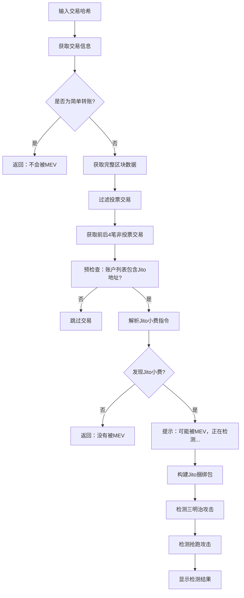

# Solana MEV 攻击检测器

一个高效的 Solana 链上交易分析工具，专门用于检测 **JITO MEV（Maximum Extractable Value）** 攻击行为，包括三明治攻击、抢跑攻击等。支持实时检测和 Jito 捆绑包分析。

## 🚀 功能特点

### 核心检测功能
- **三明治攻击检测**：智能识别前置-目标-后置交易模式
- **抢跑攻击检测**：检测相同代币对的优先执行交易
- **Jito 捆绑包分析**：自动识别 Jito 小费交易和捆绑包
- **简单转账过滤**：自动跳过不涉及 DEX 的简单转账
- **投票交易过滤**：智能过滤投票和质押交易，专注业务交易分析

### 高级特性
- **多 DEX 支持**：支持 Raydium、Orca、Serum、Jupiter、Pump.fun 等主流 DEX
- **智能交易识别**：不仅依赖程序ID，还通过账户特征识别未知DEX
- **账户重叠分析**：通过比较交易间的账户重叠检测MEV攻击
- **高效数据获取**：智能过滤投票交易，只分析前后4笔非投票交易
- **性能优化**：预检查机制，快速跳过不包含Jito小费的交易
- **智能利润估算**：基于交易复杂度的动态利润计算
- **连续检测模式**：支持多次输入交易哈希，无需重启程序
- **实时日志记录**：详细的检测过程和结果输出

## 📁 项目结构

```
src/
├── main.rs        # 主程序入口和用户交互逻辑
├── client.rs      # Solana RPC 客户端实现
├── mev.rs         # MEV 检测算法核心实现
└── config.toml    # 配置文件（需要创建）
```

## 🛠️ 运行要求

- **Rust 版本**：1.70.0 或更高（推荐使用 2021 edition）
- **Solana RPC**：需要访问 Solana 主网 RPC 节点
- **网络**：稳定的网络连接用于获取区块数据
询

## 📦 依赖项

```toml
[dependencies]
config = { version = "0.13", features = ["toml"] }
serde = { version = "1.0", features = ["derive"] }
serde_json = "1.0"
tokio = { version = "1.0", features = ["full"] }
reqwest = { version = "0.11", features = ["json"] }
log = "0.4"
env_logger = "0.10"
bs58 = "0.4"
```

## 🚀 快速开始

### 1. 克隆项目

```bash
git clone https://github.com/Tao-2022/solana-mev-detector-simple.git
cd solana-mev-detector-simple
```

### 2. 配置 RPC 地址

创建 `config.toml` 文件：

```toml
rpc_url = "https://mainnet.helius-rpc.com/?api-key=你的API密钥"
log_level = "info"
```

### 3. 编译运行

```bash
cargo run --release
```

### 4. 使用说明

程序启动后，会显示友好的交互界面：

```
============================================================
🔍 Solana MEV 检测器 v0.2.0
============================================================

请输入Solana交易哈希 (输入 'exit' 或 'quit' 退出):
> 
```

**操作方式：**
1. 直接输入交易哈希，按 Enter 开始检测
2. 输入 `exit` 或 `quit` 退出程序
3. 检测完成后会自动返回输入界面，可以继续检测新的交易

## 📊 检测流程



## 🔍 检测算法

### 投票交易过滤

为了提高检测效率和准确性，系统会自动过滤投票和质押相关交易：

1. **账户列表检查**：检查交易账户列表中是否包含投票程序账户
   - `Vote111111111111111111111111111111111111111` - 投票程序
   - `Stake11111111111111111111111111111111111111` - 质押程序

2. **程序ID检查**：检查指令的程序ID是否为投票或质押相关

3. **智能筛选**：确保获取前4笔和后4笔真正的业务交易进行分析

### 性能优化

1. **预检查机制**：在解析Jito小费指令前，先检查交易账户列表是否包含Jito小费地址
2. **早期退出**：快速跳过不包含Jito小费地址的交易，避免不必要的指令解析
3. **智能过滤**：在RPC层面就过滤投票交易，减少数据传输和处理

### 三明治攻击检测

1. **智能交易识别**：不仅检查已知DEX程序，还通过账户特征识别未知交易程序
2. **账户重叠分析**：检查前置、目标、后置交易之间的账户重叠模式
3. **攻击者识别**：通过签名者地址识别同一攻击者
4. **交易模式分析**：检查交易复杂度和账户数量模式
5. **损失阈值过滤**：只报告用户损失超过 0.001 SOL 的攻击

### 抢跑攻击检测

1. **时间窗口检查**：确保在同一 slot 内
2. **账户重叠检测**：通过账户重叠识别相同的代币对
3. **交易复杂度比较**：分析交易复杂度模式
4. **特征匹配**：检查账户数量、指令数量等抢跑特征
5. **模式识别**：识别抢跑交易的典型特征

### 智能交易识别

对于新的meme币和未知的DEX程序，系统会通过以下特征识别：

- **账户数量**：交易涉及6个以上账户
- **指令复杂度**：包含非系统程序指令
- **账户模式**：包含典型的token账户特征
- **交易结构**：符合swap交易的基本结构

### 支持的 DEX (包括但不限于)

- **Raydium AMM**: `675kPX9MHTjS2zt1qfr1NYHuzeLXfQM9H24wFSUt1Mp8`
- **Raydium CLMM**: `CAMMCzo5YL8w4VFF8KVHrK22GGUQzGdR1qJRXgKhpNzc`
- **Orca Whirlpools**: `whirLbMiicVdio4qvUfM5KAg6Ct8VwpYzGff3uctyCc`
- **Orca V1**: `9WzDXwBbmkg8ZTbNMqUxvQRAyrZzDsGYdLVL9zYtAWWM`
- **Serum DEX**: `9xQeWvG816bUx9EPjHmaT23yvVM2ZWbrrpZb9PusVFin`
- **Jupiter**: `JUP6LkbZbjS1jKKwapdHNy74zcZ3tLUZoi5QNyVTaV4`
- **Pump.fun**: `6EF8rrecthR5Dkzon8Nwu78hRvfCKubJ14M5uBEwF6P`

## 📈 示例输出

### 正常交易（简单转账）
```
✅ 该交易为简单转账，不涉及Swap，不会被MEV。
```

### 检测到 MEV 攻击
```
🔍 获取到 4 笔前置非投票交易，4 笔后置非投票交易
🔍 开始检查前后非投票交易是否包含Jito小费:
    前第1笔: https://solscan.io/tx/1A2b3...
    前第2笔: https://solscan.io/tx/4C5d6...
    后第1笔: https://solscan.io/tx/7E8f9...
    后第2笔: https://solscan.io/tx/2G3h4... ⭐ (Jito小费交易)

🔍 检测到临近交易存在Jito交易，可能被MEV，正在检测...
📋 目标交易前后的8笔非投票交易:
  1. https://solscan.io/tx/1A2b3...
  2. https://solscan.io/tx/4C5d6...
  3. https://solscan.io/tx/7E8f9...
  4. https://solscan.io/tx/2G3h4... ⭐ (Jito小费交易)

🚨 检测到Jito捆绑包! Jito捆绑包最多包含5笔交易，您的交易是其中之一。
  -> 小费交易: https://solscan.io/tx/2G3h4...
  -> 小费地址: 96gYZGLnJYVFmbjzopPSU6QiEV5fGqZNyN9nmNhvrZU5
  -> 小费金额: 100000 lamports (0.000100000 SOL)
  🥪 在Jito捆绑包内检测到三明治攻击:
    前置交易: https://solscan.io/tx/1A2b3...
    后置交易: https://solscan.io/tx/4C5d6...
    预估用户损失: 0.015000 SOL
```

### 未检测到 MEV
```
🔍 获取到 4 笔前置非投票交易，4 笔后置非投票交易
🔍 开始检查前后非投票交易是否包含Jito小费:
    前第1笔: https://solscan.io/tx/1A2b3...
    前第2笔: https://solscan.io/tx/4C5d6...
    后第1笔: https://solscan.io/tx/7E8f9...
    后第2笔: https://solscan.io/tx/2G3h4...
❌ 在前后非投票交易中未发现Jito小费交易
✅ 在前后非投票交易中未发现Jito小费地址。
💡 这可能意味着:
   1. 确实没有被MEV攻击
   2. MEV攻击不是通过Jito进行的
```

## ⚙️ 配置说明

### 日志级别
- `error`: 仅显示错误信息
- `warn`: 显示警告和错误
- `info`: 显示一般信息（推荐，包含详细的检测过程）
- `debug`: 显示详细调试信息（包含每个指令的分析过程）
- `trace`: 显示所有信息

**调试模式使用：**
设置 `log_level = "debug"` 可以看到详细的检测过程，包括：
- 每笔交易的指令分析
- 账户地址检查过程
- 指令数据解码详情
- 投票交易过滤过程
- Jito小费预检查结果

**推荐配置：**
```toml
rpc_url = "https://mainnet.helius-rpc.com/?api-key=你的API密钥"
log_level = "info"  # 生产环境推荐
# log_level = "debug"  # 调试时使用
```

### 检测参数调整

在 `src/mev.rs` 中可以调整以下参数：

```rust
const MIN_SHARED_ACCOUNTS: usize = 3;        // 最小共同账户数
const MIN_LOSS_THRESHOLD: f64 = 0.001;       // 最小损失阈值 (SOL)
```

## 🚀 性能特性

### 智能过滤机制
- **投票交易过滤**：自动跳过Solana网络中大量的投票交易
- **预检查优化**：在解析指令前先检查账户列表，避免不必要的计算
- **早期退出**：快速识别不包含MEV风险的交易

### 高效数据处理
- **最小化RPC调用**：智能缓存和批量请求
- **内存优化**：及时释放不需要的交易数据
- **并发安全**：支持多线程安全的数据访问

### 检测精度
- **多层验证**：结合程序ID、账户列表、指令数据的多重验证
- **误报控制**：通过多种特征降低误报率
- **全面覆盖**：支持已知和未知DEX的检测

## 🤝 贡献

欢迎提交 Issue 和 Pull Request！

### 开发环境设置

1. 克隆项目
2. 创建配置文件
3. 运行测试：`cargo test`
4. 格式化代码：`cargo fmt`
5. 检查代码：`cargo clippy`

## 📄 许可证

MIT License

## ⚠️ 免责声明

本工具仅用于教育和研究目的。使用本工具分析交易时，请确保遵守相关法律法规。作者不承担因使用本工具而产生的任何法律责任。

## 🔗 相关链接

- [Solana 文档](https://docs.solana.com/)
- [Jito 文档](https://jito-labs.gitbook.io/jito/)
- [MEV 研究](https://ethereum.org/en/developers/docs/mev/)

---

如果这个项目对你有帮助，请给个 ⭐️ 支持一下！
