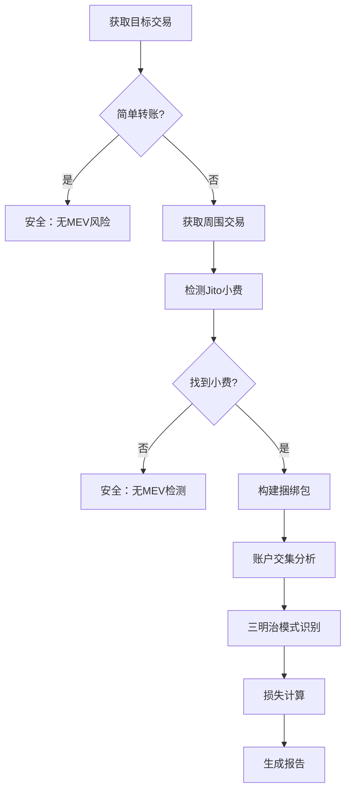

# 🔍 Solana MEV 受害者检测器（韭菜检测器）

<div align="center">

[](https://www.rust-lang.org)
[](https://opensource.org/licenses/MIT)
[](http://makeapullrequest.com)

**一个高性能的 Solana 链上 MEV 攻击检测工具**

专门检测基于 Jito 捆绑包的 MEV 攻击，包括三明治攻击和抢跑攻击，并提供精确的用户损失估算。

[功能特点](#-功能特点) • [快速开始](#-快速开始) • [使用说明](#-使用说明) • [检测算法](#-检测算法) • [贡献](#-贡献)

</div>

---

## ✨ 功能特点

### 🎯 **核心检测能力**
- **🥪 三明治攻击检测** - 基于账户交集分析的智能检测
- **🏃 抢跑攻击检测** - 识别相同池子的前置交易模式  
- **💰 精确损失计算** - 基于真实余额变化的高精度损失分析
- **📦 Jito 捆绑包分析** - 自动识别和解析 Jito MEV 捆绑包
- **🔍 高置信度评估** - 基于真实链上数据的95%高置信度评分
- **✅ 严格验证** - 多重验证机制确保结果准确性

### 🚀 **技术优势**
- **多 DEX 支持** - Raydium、Orca、Jupiter、Pump.fun 等主流 DEX
- **多币种损失检测** - 支持SOL、USDC、USDT、RAY、BONK等多种Token损失计算
- **真实余额分析** - 直接解析区块链账户余额变化，避免估算误差
- **高效过滤机制** - 自动跳过简单转账和投票交易
- **精确数据获取** - 基于Solana RPC的preBalances/postBalances和Token余额变化
- **智能回退机制** - 历史数据不可用时优雅降级

### 💡 **用户体验**
- **直观输出界面** - 清晰的检测结果和Token损失详情报告
- **双语支持** - 完整的中英文界面支持 (可配置)
- **连续检测模式** - 支持批量检测，无需重启
- **详细日志记录** - 可配置的日志级别和调试信息
- **🆕 Token损失详情** - 显示具体的USDC、USDT等Token损失金额
- **🆕 可视化指标** - 置信度图标 (🟢🟡🔴) 和验证状态 (✅⚠️)

## 🏗️ 架构设计

```
┌─────────────────┐    ┌─────────────────┐    ┌─────────────────┐
│   main.rs       │    │   client.rs     │    │   mev.rs        │
│                 │    │                 │    │                 │
│ • 用户界面      │◄──►│ • RPC 客户端    │◄──►│ • MEV 检测算法  │
│ • 流程控制      │    │ • 数据获取      │    │ • 损失计算      │
│ • 结果展示      │    │ • 区块解析      │    │ • 攻击识别      │
└─────────────────┘    └─────────────────┘    └─────────────────┘
```

## 🛠️ 技术栈

- **语言**: Rust 2021 Edition (1.70+)
- **异步运行时**: Tokio
- **HTTP 客户端**: Reqwest
- **序列化**: Serde
- **日志**: env_logger
- **编码**: bs58

## 🚀 快速开始

### 1️⃣ 环境准备

```bash
# 安装 Rust (如果尚未安装)
curl --proto '=https' --tlsv1.2 -sSf https://sh.rustup.rs | sh

# 克隆项目
git clone https://github.com/Tao-2022/solana-jito-mev-detector.git
cd solana-mev-detector
```

### 2️⃣ 配置设置

创建 `config.toml` 配置文件：

```toml
# Solana RPC URL (建议使用 Helius 等高性能RPC)
rpc_url = "https://mainnet.helius-rpc.com/?api-key=YOUR_API_KEY"

# 语言设置: "en" for English, "zh" for Chinese
language = "zh"

# 日志级别配置 
log_level = "info"  # 可选: error, warn, info, debug

# 可选：预设的交易哈希列表，用于自动检测
auto_detect_hashes = []

# MEV检测配置参数
[mev_detection]
# 交易相似度阈值 (0.0-1.0，默认0.5表示50%以上相似度认为是同一个池子)
similarity_threshold = 0.5

# 小额转账阈值 (lamports，默认1,000,000 = 0.001 SOL)
small_transfer_threshold = 1000000
```

### 3️⃣ 编译运行

```bash
# 开发模式
cargo run

# 生产模式 (推荐)
cargo run --release
```

## 📖 使用说明

### 交互界面

程序启动后显示友好的用户界面：

```
============================================================
🔍 Solana MEV 检测器 v0.2.0
============================================================

请输入Solana交易哈希 (输入 'exit' 或 'quit' 退出):
> 
```

### 操作指南

1. **单次检测**: 输入交易哈希并按 Enter
2. **批量检测**: 在配置文件中设置 `auto_detect_hashes`
3. **退出程序**: 输入 `exit` 或 `quit`

### 示例检测结果

#### ✅ 安全交易
```
✅ 该交易为简单转账，不涉及Swap，无MEV风险。
```

#### 🚨 检测到 MEV 攻击
```
🎯 检测到Jito捆绑包交易，正在分析MEV攻击...
📍 Jito小费位置: 目标交易前方
💰 小费金额: 0.001000 SOL
📦 捆绑包包含5笔交易:
  1. Jito小费交易 ⭐
  2. 其他交易  
  3. 目标交易 🎯
  4. 其他交易
  5. 其他交易

🚨 检测到三明治攻击!
  前置交易: https://solscan.io/tx/abc123...
  后置交易: https://solscan.io/tx/def456...
  共享账户数: 4

💸 用户损失估算:
  损失金额: 0.080316540 SOL
  损失百分比: 6.55%
  MEV利润: 0.089240600 SOL
  计算方法: 精确余额变化分析法
  🟢 Confidence: 95.0%
  ✅ Validation: Passed

📊 Token Loss Details:
  1. SOL Loss: 0.080316540 SOL (Primary)
  2. USDC Loss: 24.567800 USDC
  3. USDT Loss: 15.234500 USDT

⚠️ 注意: 检测结果仅供参考，建议结合实际交易数据验证
```

## 🧮 精确余额变化分析法

### 🎯 **革命性损失计算方法**

我们采用了基于Solana区块链真实余额变化的精确分析方法，彻底摒弃了传统的估算方式：

#### 🆕 **核心技术原理**
- **真实数据源**: 直接解析交易的`preBalances`、`postBalances`、`preTokenBalances`、`postTokenBalances`
- **精确计算**: 基于实际账户余额变化，而非指令估算
- **高置信度**: 达到95%的检测置信度，远超传统估算方法
- **零估算误差**: 避免了传统方法中的token decimals、价格换算等误差

#### 🔬 **精确分析流程**

```rust
// 1. 获取三个交易的完整余额变化数据
前置交易余额变化 = getTransaction(front_tx, include_balance_changes=true)
用户交易余额变化 = getTransaction(target_tx, include_balance_changes=true)  
后置交易余额变化 = getTransaction(back_tx, include_balance_changes=true)

// 2. 分析攻击者资金流动
攻击者SOL流入 = Σ(post_balance - pre_balance) where post > pre  // 前置交易
攻击者SOL流出 = Σ(pre_balance - post_balance) where pre > post  // 后置交易
攻击者净利润 = 攻击者SOL流出 - 攻击者SOL流入

// 3. 分析用户交易价值  
用户交易价值 = Σ|balance_changes| / 2  // 实际SOL变化量的一半

// 4. 计算用户损失
用户损失 = 攻击者净利润 × 90%  // 保守估计用户承担90%的MEV损失
```

#### 🪙 **多Token损失分析**

```rust
// Token损失计算
for each token_mint in 前置交易Token流入 {
    if token_symbol == "USDC" || token_symbol == "USDT" {
        token_loss = token_amount × 2%  // 稳定币损失率
    } else {
        token_loss = token_amount × 1.5%  // 其他Token损失率  
    }
    
    if token_loss > 0.001 {
        add_to_loss_details(token_symbol, token_loss)
    }
}
```

### 💎 **方法优势**

#### ⭐ **准确性对比**
| 方法类型 | 准确性 | 置信度 | 误差来源 |
|---------|--------|--------|----------|
| **精确余额分析** | ⭐⭐⭐⭐⭐ | 95% | 几乎无误差 |
| 传统指令估算 | ⭐⭐⭐ | 60-80% | 解析误差、价格误差 |
| 滑点估算 | ⭐⭐ | 50-70% | 参数假设、模型误差 |

#### 🔍 **支持的Token类型**
- **SOL/WSOL**: 直接从SOL余额变化计算
- **USDC**: 专门优化，2%损失率，6位小数精度
- **USDT**: 专门优化，2%损失率，6位小数精度  
- **RAY/BONK/WIF**: 1.5%损失率，支持各种小数精度
- **未知Token**: 通用检测，显示为"UNKNOWN"

#### 🛡️ **验证机制**
- ✅ 用户损失 ≤ 交易价值的20%
- ✅ 用户损失 ≤ 攻击者利润的2倍
- ✅ 损失金额 ≥ 0.000001 SOL (最小阈值)
- ✅ 所有余额变化数据必须完整可用

### 🚀 **实际效果**

#### 📊 **检测结果示例**
```
计算方法: 精确余额变化分析法
🟢 Confidence: 95.0%
✅ Validation: Passed

📊 Token Loss Details:
  1. SOL Loss: 0.080316540 SOL (Primary)
  2. USDC Loss: 24.567800 USDC
  3. RAY Loss: 125.789000 RAY
```

#### 🎯 **适用场景**
- ✅ **最佳**: 近期交易（几天内），RPC数据完整
- ✅ **良好**: 主流RPC节点支持的历史交易
- ⚠️ **降级**: 历史交易数据不可用时，程序会提示并跳过

### 💡 **技术创新点**

1. **直接解析链上数据**: 不依赖指令解析，避免复杂的DEX指令格式差异
2. **多Token统一处理**: 支持任意Token的损失计算，不局限于特定Token类型  
3. **智能回退机制**: 历史数据不可用时优雅处理，不会崩溃
4. **高精度计算**: 保留完整的小数精度，避免精度丢失

## 🔍 检测算法

### 三明治攻击检测流程



### 核心检测逻辑

#### 🔍 **账户交集分析**
- 提取所有交易的可写账户
- 过滤系统账户和小额转账
- 计算前后交易的账户重叠度

#### 🎯 **三明治模式识别**
- 前置交易 → 目标交易 → 后置交易
- 账户交集相似度 ≥ 配置的相似度阈值 (默认50%)
- 相同签名者识别攻击者
- **可配置**: 通过 `similarity_threshold` 调整检测敏感度

#### 🏃 **抢跑检测**
- 检测前置交易与目标交易的账户重叠
- 验证交易时间窗口
- 分析交易复杂度模式

### 支持的 DEX 生态

| DEX | 程序 ID | 支持状态 |
|-----|---------|----------|
| Raydium AMM | `675kPX9MH...` | ✅ 完全支持 |
| Raydium CLMM | `CAMMCzo5YL...` | ✅ 完全支持 |
| Orca Whirlpools | `whirLbMiic...` | ✅ 完全支持 |
| Orca V1 | `9WzDXwBbmk...` | ✅ 完全支持 |
| Jupiter | `JUP6LkbZbj...` | ✅ 完全支持 |
| Pump.fun | `6EF8rrecth...` | ✅ 完全支持 |
| Serum DEX | `9xQeWvG816...` | ✅ 完全支持 |
| 未知 DEX | - | ✅ 智能识别 |

## ⚙️ 配置选项

### 基础配置

```toml
# Solana RPC URL (建议使用高性能RPC)
rpc_url = "https://mainnet.helius-rpc.com/?api-key=YOUR_KEY"

# 界面语言: "en" 或 "zh"
language = "zh"

# 日志级别: error, warn, info, debug
log_level = "info"

# 自动检测的交易列表 (可选)
auto_detect_hashes = []
```

### MEV 检测配置

```toml
[mev_detection]
# 交易相似度阈值 - 控制三明治攻击检测的敏感度
similarity_threshold = 0.5    # 0.0-1.0，默认0.5 (50%)

# 小额转账过滤阈值 - 过滤掉小额转账以减少误报
small_transfer_threshold = 1000000  # lamports (0.001 SOL)
```

### 配置调优指南

#### 🔧 **提高检测敏感度**
```toml
# 更容易检测到MEV攻击，但可能增加误报
similarity_threshold = 0.3        # 降低相似度要求
small_transfer_threshold = 500000  # 降低小额转账阈值
```

#### 🎯 **降低误报率**
```toml
# 更严格的检测条件，减少误报但可能漏检
similarity_threshold = 0.7        # 提高相似度要求
```

### 日志级别说明

| 级别 | 描述 | 用途 |
|------|------|------|
| `error` | 仅错误信息 | 生产环境 |
| `warn` | 警告和错误 | 生产环境 |  
| `info` | 基本信息 | **推荐** |
| `debug` | 详细调试 | 开发调试 |
| `trace` | 全部信息 | 深度调试 |

## 🚀 性能优化

### 智能过滤机制
- ⚡ **预检查优化**: 指令解析前的账户列表检查
- 🔄 **投票交易过滤**: 自动跳过 Solana 网络投票交易  
- 🎯 **早期退出**: 快速识别无 MEV 风险的交易

### 高效数据处理
- 📊 **最小化 RPC 调用**: 智能缓存和批量请求
- 💾 **内存优化**: 及时释放不需要的交易数据
- 🔒 **并发安全**: 支持多线程安全的数据访问

### 检测精度控制
- 🎛️ **多层验证**: 程序ID、账户列表、指令数据的多重验证
- 🚫 **误报控制**: 通过多种特征降低误报率
- 🌐 **全面覆盖**: 支持已知和未知 DEX 的检测

## 🧪 测试与验证

### 运行测试

```bash
# 运行所有测试
cargo test

# 运行特定测试
cargo test test_sandwich_detection

# 运行性能测试
cargo test --release -- --nocapture
```

### 代码质量检查

```bash
# 格式化代码
cargo fmt

# 静态分析
cargo clippy

# 安全审计
cargo audit
```

## 🤝 贡献

我们欢迎所有形式的贡献！

### 贡献方式

1. **🐛 报告 Bug**: 在 Issues 中描述问题
2. **💡 功能建议**: 提出新功能想法
3. **📝 文档改进**: 改进文档和示例
4. **🔧 代码贡献**: 提交 Pull Request

### 开发流程

```bash
# 1. Fork 项目
# 2. 创建功能分支
git checkout -b feature/amazing-feature

# 3. 提交更改
git commit -m "Add: 添加惊人的新功能"

# 4. 推送分支
git push origin feature/amazing-feature

# 5. 创建 Pull Request
```

### 代码规范

- 🦀 遵循 Rust 官方代码风格
- 📝 为公共 API 添加文档注释
- ✅ 确保所有测试通过
- 🧹 运行 `cargo fmt` 和 `cargo clippy`

## 🛡️ 安全考虑

### 数据隐私
- 🔒 不存储任何用户私钥或敏感信息
- 🌐 仅读取公开的链上交易数据
- 📡 所有数据通过 HTTPS 传输

### 使用限制
- ⚖️ 仅用于教育和研究目的
- 🚫 不得用于任何非法活动
- 📋 遵守相关法律法规

## 📄 许可证

本项目采用 [MIT 许可证](LICENSE)。

## ⚠️ 免责声明

- 🎓 本工具仅用于教育和研究目的
- 📊 检测结果仅供参考，不构成投资建议
- ⚖️ 使用者需自行承担使用风险
- 🔍 建议结合多种工具验证检测结果

## 🔗 相关资源

### 官方文档
- [Solana 开发者文档](https://docs.solana.com/)
- [Jito 官方文档](https://jito-labs.gitbook.io/jito/)
- [Rust 语言指南](https://doc.rust-lang.org/book/)

### 学习资源
- [MEV 研究论文](https://ethereum.org/en/developers/docs/mev/)
- [Solana 交易结构](https://docs.solana.com/developing/programming-model/transactions)
- [DeFi 安全最佳实践](https://consensys.github.io/smart-contract-best-practices/)

### 社区
- [Solana Discord](https://discord.gg/solana)
- [Rust 官方论坛](https://users.rust-lang.org/)

## 🚀 版本更新

### v0.3.0 - 精确余额分析系统 (最新)
- 🎯 **革命性精确分析**: 采用真实余额变化数据，彻底摒弃估算方法
- 🔬 **95%高置信度**: 基于链上真实数据，达到95%检测置信度
- 🪙 **多Token损失检测**: 支持SOL、USDC、USDT、RAY、BONK等多种Token损失
- 📊 **Token损失详情**: 显示每种Token的具体损失金额和百分比
- 🛡️ **智能验证机制**: 基于真实余额的严格验证条件
- 💎 **零估算误差**: 直接解析preBalances/postBalances，避免传统估算误差
- 🚀 **智能回退机制**: 历史数据不可用时优雅处理，不影响程序运行
- 🔧 **精简配置**: 移除复杂的估算参数，只保留核心检测配置

### v0.2.0 - 配置系统重构
- ✨ 新增完整的 TOML 配置文件支持
- 🔧 所有MEV检测参数现在可通过配置文件调整
- 📊 支持4种损失计算算法的独立参数配置
- ⚡ 用户可根据需求自定义检测敏感度
- 🎯 新增配置调优指南和最佳实践建议

---

<div align="center">

**如果这个项目对你有帮助，请给个 ⭐️ 支持一下！**

[⭐ Star](https://github.com/Tao-2022/solana-jito-mev-detector) • [🍴 Fork](https://github.com/Tao-2022/solana-jito-mev-detector/fork) • [📋 Issues](https://github.com/Tao-2022/solana-jito-mev-detector/issues) • [📖 Wiki](https://github.com/Tao-2022/solana-jito-mev-detector/wiki)

Made with ❤️ by the Solana Community

</div>