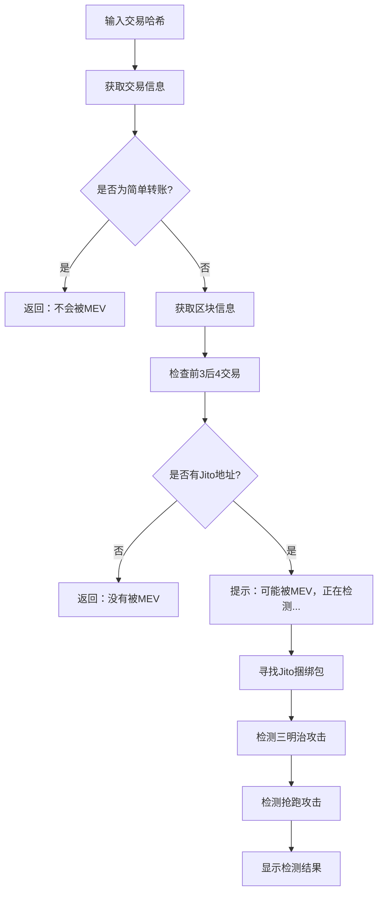

# Solana MEV 攻击检测器

一个强大的 Solana 链上交易分析工具，专门用于检测 **MEV（Maximum Extractable Value）** 攻击行为，包括三明治攻击、抢跑攻击等。支持实时检测和 Jito 捆绑包分析。

## 🚀 功能特点

### 核心检测功能
- **三明治攻击检测**：智能识别前置-目标-后置交易模式
- **抢跑攻击检测**：检测相同代币对的优先执行交易
- **Jito 捆绑包分析**：自动识别 Jito 小费交易和捆绑包
- **简单转账过滤**：自动跳过不涉及 DEX 的简单转账

### 高级特性
- **多 DEX 支持**：支持 Raydium、Orca、Serum、Jupiter 等主流 DEX
- **智能利润估算**：基于交易复杂度的动态利润计算
- **连续检测模式**：支持多次输入交易哈希，无需重启程序
- **实时日志记录**：详细的检测过程和结果输出

## 📁 项目结构

```
src/
├── main.rs        # 主程序入口和用户交互逻辑
├── client.rs      # Solana RPC 客户端实现
├── mev.rs         # MEV 检测算法核心实现
└── config.toml    # 配置文件（需要创建）
```

## 🛠️ 运行要求

- **Rust 版本**：1.70.0 或更高（推荐使用 2021 edition）
- **Solana RPC**：需要访问 Solana 主网 RPC 节点
- **网络**：稳定的网络连接用于获取区块数据
询

## 📦 依赖项

```toml
[dependencies]
crossterm = "0.27"
config = { version = "0.13", features = ["toml"] }
serde = { version = "1.0", features = ["derive"] }
serde_json = "1.0"
tokio = { version = "1.0", features = ["full"] }
reqwest = { version = "0.11", features = ["json"] }
log = "0.4"
env_logger = "0.10"
bs58 = "0.4"
```

## 🚀 快速开始

### 1. 克隆项目

```bash
git clone https://github.com/Tao-2022/solana-mev-detector-simple.git
cd solana-mev-detector-simple
```

### 2. 配置 RPC 地址

创建 `config.toml` 文件：

```toml
rpc_url = "https://mainnet.helius-rpc.com/?api-key=你的API密钥"
log_level = "info"
```

### 3. 编译运行

```bash
cargo run --release
```

### 4. 使用说明

程序启动后，按照提示操作：

1. 输入 Solana 交易哈希
2. 按 Enter 键开始检测
3. 查看检测结果
4. 按任意键继续检测新的交易，或按 ESC 键退出

## 📊 检测流程



## 🔍 检测算法

### 三明治攻击检测

1. **DEX 交易验证**：确保所有交易都涉及 DEX 操作
2. **代币对匹配**：检查前置、目标、后置交易是否涉及相同代币对
3. **攻击者识别**：通过签名者地址识别同一攻击者
4. **操作类型分析**：验证前置和后置交易具有相反操作
5. **损失阈值过滤**：只报告用户损失超过 0.001 SOL 的攻击

### 抢跑攻击检测

1. **时间窗口检查**：确保在同一 slot 内
2. **DEX 程序匹配**：使用相同的 DEX 程序
3. **交易复杂度比较**：抢跑交易通常更复杂
4. **代币对一致性**：涉及相同的代币对
5. **优先级费用推断**：通过复杂度推断 gas 费用差异

### 支持的 DEX

- **Raydium AMM**: `675kPX9MHTjS2zt1qfr1NYHuzeLXfQM9H24wFSUt1Mp8`
- **Raydium CLMM**: `CAMMCzo5YL8w4VFF8KVHrK22GGUQzGdR1qJRXgKhpNzc`
- **Orca Whirlpools**: `whirLbMiicVdio4qvUfM5KAg6Ct8VwpYzGff3uctyCc`
- **Orca V1**: `9WzDXwBbmkg8ZTbNMqUxvQRAyrZzDsGYdLVL9zYtAWWM`
- **Serum DEX**: `9xQeWvG816bUx9EPjHmaT23yvVM2ZWbrrpZb9PusVFin`
- **Jupiter**: `JUP6LkbZbjS1jKKwapdHNy74zcZ3tLUZoi5QNyVTaV4`

## 📈 示例输出

### 正常交易（简单转账）
```
✅ 该交易为简单转账，不涉及Swap，不会被MEV。
```

### 检测到 MEV 攻击
```
🔍 检测到临近交易存在Jito交易，可能被MEV，正在检测...
🚨 检测到Jito捆绑包! Jito捆绑包最多包含5笔交易，您的交易是其中之一。
  -> 小费交易: https://solscan.io/tx/5X7k2...
  -> 小费地址: 96gYZGLnJYVFmbjzopPSU6QiEV5fGqZNyN9nmNhvrZU5
  -> 小费金额: 100000 lamports (0.000100000 SOL)
  🥪 在Jito捆绑包内检测到三明治攻击:
    前置交易: https://solscan.io/tx/3B8k1...
    后置交易: https://solscan.io/tx/7Y2m9...
检测到三明治攻击模式，预估损失: 0.015000 SOL
```

### 未检测到 MEV
```
✅ 在前3笔和后4笔交易中未发现Jito小费地址。没有被MEV。
```

## ⚙️ 配置说明

### 日志级别
- `error`: 仅显示错误信息
- `warn`: 显示警告和错误
- `info`: 显示一般信息（推荐）
- `debug`: 显示详细调试信息
- `trace`: 显示所有信息

### 检测参数调整

在 `src/mev.rs` 中可以调整以下参数：

```rust
const MIN_SHARED_ACCOUNTS: usize = 3;        // 最小共同账户数
const MIN_LOSS_THRESHOLD: f64 = 0.001;       // 最小损失阈值 (SOL)
```

## 🤝 贡献

欢迎提交 Issue 和 Pull Request！

### 开发环境设置

1. 克隆项目
2. 创建配置文件
3. 运行测试：`cargo test`
4. 格式化代码：`cargo fmt`
5. 检查代码：`cargo clippy`

## 📄 许可证

MIT License

## ⚠️ 免责声明

本工具仅用于教育和研究目的。使用本工具分析交易时，请确保遵守相关法律法规。作者不承担因使用本工具而产生的任何法律责任。

## 🔗 相关链接

- [Solana 文档](https://docs.solana.com/)
- [Jito 文档](https://jito-labs.gitbook.io/jito/)
- [MEV 研究](https://ethereum.org/en/developers/docs/mev/)

---

如果这个项目对你有帮助，请给个 ⭐️ 支持一下！
