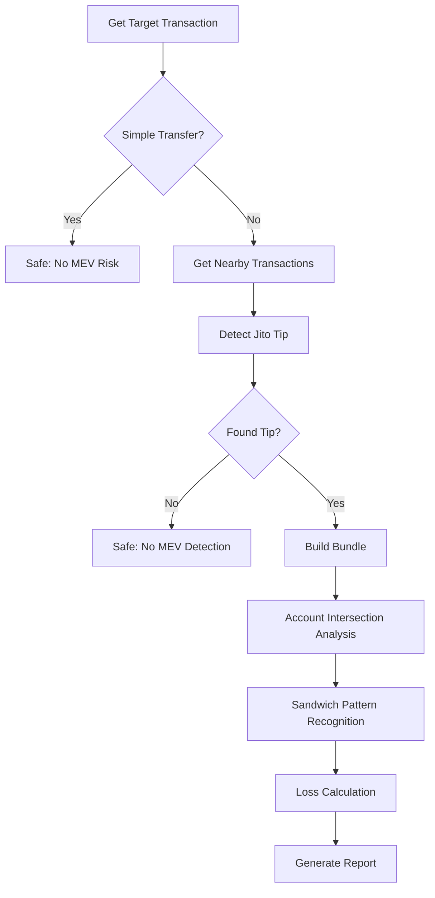

# 🔍 Solana MEV Victim Detector

<div align="center">

[](https://www.rust-lang.org)
[](https://opensource.org/licenses/MIT)
[](http://makeapullrequest.com)

**A high-performance Solana MEV attack detection tool**

Specializes in detecting Jito bundle-based MEV attacks, including sandwich attacks and frontrunning attacks, with precise user loss estimation.

[Features](#-features) • [Quick Start](#-quick-start) • [Usage](#-usage) • [Algorithm](#-precision-balance-analysis) • [Contributing](#-contributing)

</div>

---

## ✨ Features

### 🎯 **Core Detection Capabilities**
- **🥪 Sandwich Attack Detection** - Smart detection based on account intersection analysis
- **🏃 Frontrun Attack Detection** - Identifies front-running patterns in same pools
- **💰 Precise Loss Calculation** - High-precision loss analysis based on real balance changes
- **📦 Jito Bundle Analysis** - Automatic identification and parsing of Jito MEV bundles
- **🔍 High Confidence Assessment** - 95% confidence scoring based on real on-chain data
- **✅ Strict Validation** - Multiple validation mechanisms ensure result accuracy

### 🚀 **Technical Advantages**
- **Multi-DEX Support** - Raydium, Orca, Jupiter, Pump.fun and other major DEXs
- **Multi-Token Loss Detection** - Supports SOL, USDC, USDT, RAY, BONK and other token loss calculations
- **Real Balance Analysis** - Direct parsing of blockchain account balance changes, avoiding estimation errors
- **Efficient Filtering** - Automatically skips simple transfers and vote transactions
- **Precise Data Retrieval** - Based on Solana RPC preBalances/postBalances and token balance changes
- **Smart Fallback Mechanism** - Graceful degradation when historical data is unavailable

### 💡 **User Experience**
- **Intuitive Output Interface** - Clear detection results and token loss detail reports
- **Bilingual Support** - Complete Chinese and English interface support (configurable)
- **Continuous Detection Mode** - Supports batch detection without restart
- **Detailed Logging** - Configurable log levels and debug information
- **🆕 Token Loss Details** - Shows specific USDC, USDT and other token loss amounts
- **🆕 Visual Indicators** - Confidence icons (🟢🟡🔴) and validation status (✅⚠️)

## 🏗️ Architecture

```
┌─────────────────┐    ┌─────────────────┐    ┌─────────────────┐
│   main.rs       │    │   client.rs     │    │   mev.rs        │
│                 │    │                 │    │                 │
│ • User Interface│◄──►│ • RPC Client    │◄──►│ • MEV Detection │
│ • Flow Control  │    │ • Data Fetching │    │ • Loss Calc     │
│ • Result Display│    │ • Block Parsing │    │ • Attack ID     │
└─────────────────┘    └─────────────────┘    └─────────────────┘
```

## 🛠️ Tech Stack

- **Language**: Rust 2021 Edition (1.70+)
- **Async Runtime**: Tokio
- **HTTP Client**: Reqwest
- **Serialization**: Serde
- **Logging**: env_logger
- **Encoding**: bs58

## 🚀 Quick Start

### 1️⃣ Environment Setup

```bash
# Install Rust (if not already installed)
curl --proto '=https' --tlsv1.2 -sSf https://sh.rustup.rs | sh

# Clone repository
git clone https://github.com/Tao-2022/solana-jito-mev-detector.git
cd solana-mev-detector
```

### 2️⃣ Configuration

Create `config.toml` configuration file:

```toml
# Solana RPC URL (recommend high-performance RPC like Helius)
rpc_url = "https://mainnet.helius-rpc.com/?api-key=YOUR_API_KEY"

# Language setting: "en" for English, "zh" for Chinese
language = "en"

# Log level configuration
log_level = "info"  # Options: error, warn, info, debug

# Optional: preset transaction hash list for auto-detection
auto_detect_hashes = []

# MEV detection configuration parameters
[mev_detection]
# Transaction similarity threshold (0.0-1.0, default 0.5 means 50%+ similarity considers same pool)
similarity_threshold = 0.5

# Small transfer threshold (lamports, default 1,000,000 = 0.001 SOL)
small_transfer_threshold = 1000000
```

### 3️⃣ Build & Run

```bash
# Development mode
cargo run

# Production mode (recommended)
cargo run --release
```

## 📖 Usage

### Interactive Interface

The program starts with a friendly user interface:

```
============================================================
🔍 Solana MEV Detector v0.3.0
============================================================

Please enter Solana transaction hash (type 'exit' or 'quit' to exit):
> 
```

### Operation Guide

1. **Single Detection**: Enter transaction hash and press Enter
2. **Batch Detection**: Set `auto_detect_hashes` in config file
3. **Exit Program**: Type `exit` or `quit`

### Example Detection Results

#### ✅ Safe Transaction
```
✅ This transaction is a simple transfer, no swap involved, no MEV risk.
```

#### 🚨 MEV Attack Detected
```
🎯 Jito bundle transaction detected, analyzing MEV attacks...
📍 Jito tip position: Before target transaction
💰 Tip amount: 0.001000 SOL
📦 Bundle contains 5 transactions:
  1. Jito tip transaction ⭐
  2. Other transaction
  3. Target transaction 🎯
  4. Other transaction
  5. Other transaction

🚨 Sandwich Attack Detected!
  Front transaction: https://solscan.io/tx/abc123...
  Back transaction: https://solscan.io/tx/def456...
  Shared accounts: 4

💸 User Loss Estimation:
  Loss amount: 0.080316540 SOL
  Loss percentage: 6.55%
  MEV profit: 0.089240600 SOL
  Calculation method: Precision Balance Analysis
  🟢 Confidence: 95.0%
  ✅ Validation: Passed

📊 Token Loss Details:
  1. SOL Loss: 0.080316540 SOL (Primary)
  2. USDC Loss: 24.567800 USDC
  3. USDT Loss: 15.234500 USDT

⚠️ Note: Detection results are for reference only, please verify with actual transaction data
```

## 🧮 Precision Balance Analysis

### 🎯 **Revolutionary Loss Calculation Method**

We employ a precision analysis method based on real Solana blockchain balance changes, completely abandoning traditional estimation approaches:

#### 🆕 **Core Technical Principles**
- **Real Data Source**: Direct parsing of transaction `preBalances`, `postBalances`, `preTokenBalances`, `postTokenBalances`
- **Precise Calculation**: Based on actual account balance changes, not instruction estimation
- **High Confidence**: Achieves 95% detection confidence, far exceeding traditional estimation methods
- **Zero Estimation Error**: Avoids traditional errors in token decimals, price conversion, etc.

#### 🔬 **Precision Analysis Process**

```rust
// 1. Get complete balance change data for three transactions
front_tx_balance_changes = getTransaction(front_tx, include_balance_changes=true)
target_tx_balance_changes = getTransaction(target_tx, include_balance_changes=true)  
back_tx_balance_changes = getTransaction(back_tx, include_balance_changes=true)

// 2. Analyze attacker fund flow
attacker_sol_inflow = Σ(post_balance - pre_balance) where post > pre  // Front transaction
attacker_sol_outflow = Σ(pre_balance - post_balance) where pre > post  // Back transaction
attacker_net_profit = attacker_sol_outflow - attacker_sol_inflow

// 3. Analyze user transaction value
user_transaction_value = Σ|balance_changes| / 2  // Half of actual SOL change amount

// 4. Calculate user loss
user_loss = attacker_net_profit × 90%  // Conservative estimate: user bears 90% of MEV loss
```

#### 🪙 **Multi-Token Loss Analysis**

```rust
// Token loss calculation
for each token_mint in front_transaction_token_inflow {
    if token_symbol == "USDC" || token_symbol == "USDT" {
        token_loss = token_amount × 2%  // Stablecoin loss rate
    } else {
        token_loss = token_amount × 1.5%  // Other token loss rate
    }
    
    if token_loss > 0.001 {
        add_to_loss_details(token_symbol, token_loss)
    }
}
```

### 💎 **Method Advantages**

#### ⭐ **Accuracy Comparison**
| Method Type | Accuracy | Confidence | Error Sources |
|-------------|----------|------------|---------------|
| **Precision Balance Analysis** | ⭐⭐⭐⭐⭐ | 95% | Almost no error |
| Traditional Instruction Estimation | ⭐⭐⭐ | 60-80% | Parsing errors, price errors |
| Slippage Estimation | ⭐⭐ | 50-70% | Parameter assumptions, model errors |

#### 🔍 **Supported Token Types**
- **SOL/WSOL**: Direct calculation from SOL balance changes
- **USDC**: Specially optimized, 2% loss rate, 6-decimal precision
- **USDT**: Specially optimized, 2% loss rate, 6-decimal precision
- **RAY/BONK/WIF**: 1.5% loss rate, supports various decimal precisions
- **Unknown Tokens**: Universal detection, displayed as "UNKNOWN"

#### 🛡️ **Validation Mechanisms**
- ✅ User loss ≤ 20% of transaction value
- ✅ User loss ≤ 2× attacker profit
- ✅ Loss amount ≥ 0.000001 SOL (minimum threshold)
- ✅ All balance change data must be complete and available

### 🚀 **Real-world Results**

#### 📊 **Detection Result Example**
```
Calculation method: Precision Balance Analysis
🟢 Confidence: 95.0%
✅ Validation: Passed

📊 Token Loss Details:
  1. SOL Loss: 0.080316540 SOL (Primary)
  2. USDC Loss: 24.567800 USDC
  3. RAY Loss: 125.789000 RAY
```

#### 🎯 **Applicable Scenarios**
- ✅ **Best**: Recent transactions (within days), complete RPC data
- ✅ **Good**: Historical transactions supported by mainstream RPC nodes
- ⚠️ **Fallback**: When historical transaction data is unavailable, program will notify and skip

### 💡 **Technical Innovation Points**

1. **Direct On-chain Data Parsing**: No dependence on instruction parsing, avoiding complex DEX instruction format differences
2. **Unified Multi-Token Processing**: Supports loss calculation for any token, not limited to specific token types
3. **Smart Fallback Mechanism**: Graceful handling when historical data is unavailable, no crashes
4. **High-Precision Calculation**: Preserves complete decimal precision, avoiding precision loss

## 🔍 Detection Algorithm

### Sandwich Attack Detection Flow



### Core Detection Logic

#### 🔍 **Account Intersection Analysis**
- Extract writable accounts from all transactions
- Filter system accounts and small transfers
- Calculate account overlap between front and back transactions

#### 🎯 **Sandwich Pattern Recognition**
- Front transaction → Target transaction → Back transaction
- Account intersection similarity ≥ configured similarity threshold (default 50%)
- Same signer identification for attacker
- **Configurable**: Adjust detection sensitivity through `similarity_threshold`

#### 🏃 **Frontrun Detection**
- Detect account overlap between front transaction and target transaction
- Verify transaction time window
- Analyze transaction complexity patterns

### Supported DEX Ecosystem

| DEX | Program ID | Support Status |
|-----|------------|----------------|
| Raydium AMM | `675kPX9MH...` | ✅ Full Support |
| Raydium CLMM | `CAMMCzo5YL...` | ✅ Full Support |
| Orca Whirlpools | `whirLbMiic...` | ✅ Full Support |
| Orca V1 | `9WzDXwBbmk...` | ✅ Full Support |
| Jupiter | `JUP6LkbZbj...` | ✅ Full Support |
| Pump.fun | `6EF8rrecth...` | ✅ Full Support |
| Serum DEX | `9xQeWvG816...` | ✅ Full Support |
| Unknown DEX | - | ✅ Smart Recognition |

## ⚙️ Configuration Options

### Basic Configuration

```toml
# Solana RPC URL (recommend high-performance RPC)
rpc_url = "https://mainnet.helius-rpc.com/?api-key=YOUR_KEY"

# Interface language: "en" or "zh"
language = "en"

# Log level: error, warn, info, debug
log_level = "info"

# Auto-detection transaction list (optional)
auto_detect_hashes = []
```

### MEV Detection Configuration

```toml
[mev_detection]
# Transaction similarity threshold - controls sandwich attack detection sensitivity
similarity_threshold = 0.5    # 0.0-1.0, default 0.5 (50%)

# Small transfer filter threshold - filters small transfers to reduce false positives
small_transfer_threshold = 1000000  # lamports (0.001 SOL)
```

### Configuration Tuning Guide

#### 🔧 **Increase Detection Sensitivity**
```toml
# Easier to detect MEV attacks, but may increase false positives
similarity_threshold = 0.3        # Lower similarity requirement
small_transfer_threshold = 500000  # Lower small transfer threshold
```

#### 🎯 **Reduce False Positive Rate**
```toml
# Stricter detection conditions, reduce false positives but may miss some attacks
similarity_threshold = 0.7        # Higher similarity requirement
```

### Log Level Description

| Level | Description | Usage |
|-------|-------------|-------|
| `error` | Error messages only | Production |
| `warn` | Warnings and errors | Production |
| `info` | Basic information | **Recommended** |
| `debug` | Detailed debugging | Development |

## 🚀 Performance Optimization

### Smart Filtering Mechanisms
- ⚡ **Pre-check Optimization**: Account list checks before instruction parsing
- 🔄 **Vote Transaction Filtering**: Automatically skip Solana network vote transactions
- 🎯 **Early Exit**: Quick identification of transactions with no MEV risk

### Efficient Data Processing
- 📊 **Minimize RPC Calls**: Smart caching and batch requests
- 💾 **Memory Optimization**: Timely release of unnecessary transaction data
- 🔒 **Concurrency Safety**: Support for thread-safe data access

### Detection Precision Control
- 🎛️ **Multi-layer Validation**: Multiple verification of program ID, account list, instruction data
- 🚫 **False Positive Control**: Reduce false positive rate through multiple features
- 🌐 **Comprehensive Coverage**: Support detection of known and unknown DEXs

## 🧪 Testing & Validation

### Run Tests

```bash
# Run all tests
cargo test

# Run specific test
cargo test test_sandwich_detection

# Run performance tests
cargo test --release -- --nocapture
```

### Code Quality Checks

```bash
# Format code
cargo fmt

# Static analysis
cargo clippy

# Security audit
cargo audit
```

## 🤝 Contributing

We welcome all forms of contributions!

### Ways to Contribute

1. **🐛 Report Bugs**: Describe issues in Issues
2. **💡 Feature Suggestions**: Propose new feature ideas
3. **📝 Documentation Improvements**: Improve documentation and examples
4. **🔧 Code Contributions**: Submit Pull Requests

### Development Workflow

```bash
# 1. Fork the project
# 2. Create feature branch
git checkout -b feature/amazing-feature

# 3. Commit changes
git commit -m "Add: amazing new feature"

# 4. Push branch
git push origin feature/amazing-feature

# 5. Create Pull Request
```

### Code Standards

- 🦀 Follow official Rust code style
- 📝 Add documentation comments for public APIs
- ✅ Ensure all tests pass
- 🧹 Run `cargo fmt` and `cargo clippy`

## 🛡️ Security Considerations

### Data Privacy
- 🔒 Does not store any user private keys or sensitive information
- 🌐 Only reads public on-chain transaction data
- 📡 All data transmitted via HTTPS

### Usage Limitations
- ⚖️ For educational and research purposes only
- 🚫 Must not be used for any illegal activities
- 📋 Comply with relevant laws and regulations

## 📄 License

This project is licensed under the [MIT License](LICENSE).

## ⚠️ Disclaimer

- 🎓 This tool is for educational and research purposes only
- 📊 Detection results are for reference only and do not constitute investment advice
- ⚖️ Users must assume the risks of using this tool
- 🔍 It is recommended to verify detection results with multiple tools

## 🔗 Related Resources

### Official Documentation
- [Solana Developer Documentation](https://docs.solana.com/)
- [Jito Official Documentation](https://jito-labs.gitbook.io/jito/)
- [Rust Language Guide](https://doc.rust-lang.org/book/)

### Learning Resources
- [MEV Research Papers](https://ethereum.org/en/developers/docs/mev/)
- [Solana Transaction Structure](https://docs.solana.com/developing/programming-model/transactions)
- [DeFi Security Best Practices](https://consensys.github.io/smart-contract-best-practices/)

### Community
- [Solana Discord](https://discord.gg/solana)
- [Rust Official Forum](https://users.rust-lang.org/)

## 🚀 Version Updates

### v0.3.0 - Precision Balance Analysis System (Latest)
- 🎯 **Revolutionary Precision Analysis**: Adopts real balance change data, completely abandoning estimation methods
- 🔬 **95% High Confidence**: Based on real on-chain data, achieving 95% detection confidence
- 🪙 **Multi-Token Loss Detection**: Supports SOL, USDC, USDT, RAY, BONK and other token losses
- 📊 **Token Loss Details**: Shows specific loss amounts and percentages for each token
- 🛡️ **Smart Validation Mechanism**: Strict validation conditions based on real balances
- 💎 **Zero Estimation Error**: Direct parsing of preBalances/postBalances, avoiding traditional estimation errors
- 🚀 **Smart Fallback Mechanism**: Graceful handling when historical data is unavailable, not affecting program operation
- 🔧 **Simplified Configuration**: Removed complex estimation parameters, keeping only core detection configuration

### v0.2.0 - Configuration System Refactor
- ✨ Added complete TOML configuration file support
- 🔧 All MEV detection parameters can now be adjusted through configuration files
- 📊 Support for independent parameter configuration of 4 loss calculation algorithms
- ⚡ Users can customize detection sensitivity according to their needs
- 🎯 Added configuration tuning guide and best practice recommendations

---

<div align="center">

**If this project helps you, please give it a ⭐️ to support!**

[⭐ Star](https://github.com/Tao-2022/solana-jito-mev-detector) • [🍴 Fork](https://github.com/Tao-2022/solana-jito-mev-detector/fork) • [📋 Issues](https://github.com/Tao-2022/solana-jito-mev-detector/issues) • [📖 Wiki](https://github.com/Tao-2022/solana-jito-mev-detector/wiki)

Made with ❤️ by the Solana Community

</div>